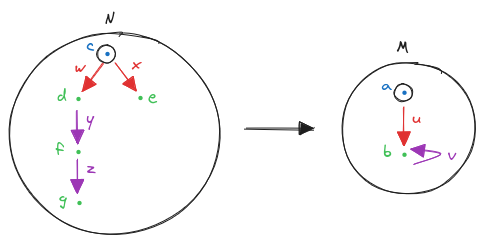
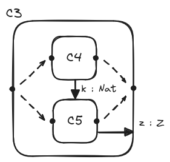
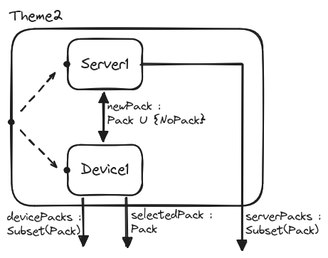

# License


This work is licensed under a Creative Commons Attribution 4.0 International
License: <https://creativecommons.org/licenses/by/4.0/>


# Introduction

This is a tutorial on modeling, or how to describe a system before implementing
it. When we want to solve a problem, we always have some kind of mental model.
This mental model is usually implicit, partial and quite fuzzy. Modeling is
about making this mental model explicit, which has several benefits.

First, it allows us to better understand the problem we want to solve. This is
generally the case that making things explicit makes us realize how limited our
initial understanding was. Making things explicit raises new questions that must
be answered. Thus, we solve design problems as early as possible, and we avoid
as much as possible the situation where they are discovered during the
implementation phase. And of course, the sooner design problems are discovered,
the cheaper.

Second, modeling implies objectiveness. We could say that modeling is analog to
drawing blueprints before starting the construction of a building. Using some
formalism, our model can be understood by various people, independently of their
cultures or preferences. On the contrary, when we leave our mental model
implicit, communicating it in a faithful manner is more difficult. Each person
will in fact have his own mental model slightly (or not so slightly) different
from other's. And serious problems start when people think they have understood
each other while their views are incompatible. So making communication easier
and more reliable is a second benefit of modeling.

Third, modeling usually enables us to use tools to help us. One example is the
ability to perform simulations to predict how the system to build will behave.
This is common to all engineering branches: a bridge wouldn't be built without
simulating its behavior with respect to wind or earthquakes, or a rocket
wouldn't be built without some physical model. Sometimes modeling comes with
tools that allow us to prove the properties of our system. For instance, we may
be interested in some safety properties being invariant (e.g. "it is always the
case that the cover is closed when the robot moves").

In this tutorial, we will use the
[\TLA](https://lamport.azurewebsites.net/tla/tla.html) language. It is
well-known in the industry (used at AWS, Intel, Microsoft...), quite simple and
comes with useful tools. In particular, it allows one to perform simulations and
proofs.

The goal of this tutorial is to provide an integrated overview of modeling from
an engineering perspective. This includes topics such as how to incrementally
refine a model, how to decompose it if it becomes too large, how to check it
through simulation, how to prove its interesting properties and finally, how to
check that an implementation effectively conforms to its model.

We will in the first part introduce essential notions, simulation, refinement
and basic proofs through the example of a wall clock. In the second part, we
will tackle model (de)composition through the example of a simple client-server
exchange mechanism. In the third and final part, we will implement the system of
the second part and show how to check it conforms to its model.


# Modeling, checking, refining, proving

## The basic wall clock

### Modeling

Let's begin with the model of a wall clock. A model is always a simplification
of the reality, and it is our responsibility to decide how much we want to
simplify it. For now, we'll describe a simple clock with only two needles, one
for minutes and one for hours. The only event we'll be interested in is the fact
that one minute has just elapsed. This simple setting will allow us to introduce
the essential notions of modeling with \TLA. In a second step, we will refine
this model to add an alarm feature.

At a given time, a system is always in a precise *state*. In the case of the
wall clock, we are not interested in detail such as the angle of each needle,
but only in their logical values. That is, the state of the clock is given by
the pair $(hour, minute)$, where $hour$ is in $0..12$ and $minute$ in $0..59$
(bounds are included). This state changes when one minute has elapsed. Thus, one
sequence of clock's states is for instance:

$(8, 27) → (8, 28) → (8, 29) → ...$

Describing a model in \TLA is done basically in three steps:

1. define the variables describing a system state

2. define the possible initial states

3. define the events

An event makes the system "jump" from one state to another. We will generally
call a jump a *step*. The systems described in \TLA are discrete, not
continuous. Continuous systems are good to describe natural phenomenons, while
discrete systems are good to describe computer systems. A *behavior* of the
system is simply a sequence of states.

We now look at the syntax of \TLA. You may test as we go along by downloading
the so-called ["\TLA toolbox" IDE](https://github.com/tlaplus/tlaplus/releases).
A [VS Code
extension](https://marketplace.visualstudio.com/items?itemName=alygin.vscode-tlaplus&ssr=false#overview)
also exists, that seems nice (not tested though) but it does not support the
prover yet so we will stick in this tutorial with the "toolbox" IDE (from now
on, simply called IDE).

First, in the IDE create a new model (called here a "Spec"):
`File > Open Spec > Add New Spec...`{.txt}

You can see on the first line that \TLA models are structured in modules, which
will be useful when decomposing large models.

The first thing we do is importing the `Naturals`{.tla} module to get the
`n..m`{.tla} notation:

```tla
EXTENDS Naturals
```

We then describe the model's state, i.e. its collection of variables:

```tla
VARIABLES hour, minute
```

Next, we define the initial states. We decide that the clock can start at any
time:

```tla
Init ==
  /\ hour \in 1..12
  /\ minute \in 0..59
```

Note: To facilitate the reading, this document uses a
[font](https://github.com/jskri/FiraTlas/releases/download/v0.1/FiraTlas-Regular.ttf)
to render the ASCII version of the mathematical symbols as in the pretty
printing of specs in PDF (see `File > Produce PDF Version`{.txt}). For instance,
`==`{.tla}, `/\`{.tla} and `\in`{.tla} are respectively typed as "==", "/\\"
and\ "\\in" in ASCII. You can of course also use the said font in the IDE. All
model sources can be found
[here](https://github.com/jskri/modeling-with-tla/tree/master/src).

`==`{.tla} means "equals by definition", i.e. it is used to define new symbols.
`/\`{.tla} is the boolean "and", and `\in`{.tla} means "belongs to set". Here,
the two `/\`{.tla} have been aligned vertically to avoid some parentheses. `hour
\in 1..12`{.tla} is true *iff* (if and only if) `hour`{.tla} is in the set ${1,
2, 3, 4, 5, 6, 7, 8, 9, 10, 11, 12}$. So `Init`{.tla} means that a state is
initial *iff* its hour is in $1..12$ and its minute is in $0..59$. The name
`Init`{.tla} is by itself arbitrary, as any other symbol you may define in \TLA.

Finally, we describe our "next minute" event:

```tla
Next ==
  /\ hour' = IF minute = 59 THEN (hour % 12) + 1 ELSE hour
  /\ minute' = (minute + 1) % 60
```

`hour'`{.tla} is the hour in the next state, i.e. after the step.
`IF...THEN...ELSE`{.tla} is an expression, so it yields a value, here a natural
number. `=`{.tla} is mathematical equality, not assignment (which does not exist
in \TLA), and `%`{.tla} is the natural numbers' modulo. So `Next`{.tla} says
which steps are valid by relating the current state to the next one. For
instance,

$$(hour=8, minute=27) → (hour'=8, minute'=28)$$

is a valid step, but

$$(hour=8, minute=27) → (hour'=5, minute'=13)$$

is of course not.

That's it, we've just described our first very simple model. The whole code is:

```tla
------------------------------ MODULE WallClock ------------------------------
EXTENDS Naturals
VARIABLES hour, minute

Init ==
  /\ hour \in 1..12
  /\ minute \in 0..59

Next ==
  /\ hour' = IF minute = 59 THEN (hour % 12) + 1 ELSE hour
  /\ minute' = (minute + 1) % 60
==============================================================================
```

In the above code
```tla
------------------------------ MODULE WallClock ------------------------------
```
marks the beginning of the specification, while
```tla
==============================================================================
```
marks its end. Do not write code beyond these boundaries!

You can find this code
[here](https://github.com/jskri/modeling-with-tla/tree/master/src/wallclock/WallClock.tla),
with some small additions that will be covered later.

"Variables - Init - Next" will be the basic skeleton of all our models. Indeed,
a \TLA model is always defined inductively by an "initial state" predicate and
a "next state" predicate. As we go along, we will add more elements to this
basic structure.


### Checking

We can now perform a simulation through the so-called *checker*. Select in the
IDE menu `TLC Model Checker > New Model...`{.txt}. What is called here a "model"
is a configuration of the checker. In the "What is the behavior spec?" section,
the fields "Init" and "Next" should already be filled with values `Init`{.tla}
and `Next`{.tla}.

Run the checker (F11). It should quickly finish by showing some stats. To
explain these, we must understand what the checker actually does. The following
diagram represents an example of a \TLA model:

<div id="diagram_tla_model"></div>
{ width=30% }

\FloatBarrier

"States" is the set of all system states, so each dot represents a state. The
three surrounded states inside are the initial states. The blue arrows represent
the possible steps. In the general case, from a given state several steps may be
possible, i.e. a state may have several next states. Also, some states may not
be attainable from the initial states (i.e. no successive steps lead to them),
some states may be their own next state, and so on. The wall clock case is very
simple in comparison since each state has exactly one next state.

The checker exhaustively explores the set of states, starting from initial
states, in a breadth-first order by default:

<div id="diagram_checking_of_a_model"></div>
{ width=30%}

\FloatBarrier

The numbers represent the exploration order: first $1$, then $2$, then $3$...
When a state has already been explored, such as $3$ which is both initial and
the next state of $2$, it is not explored again.

The checker stats are for instance:

- the found state count, counting a state once for each path that reaches it (in
  our example diagram, state $3$ is reached by being initial and by being the
successor of state 2, so state $3$ would be counted twice).

- the distinct state count, counting each reached state only once whatever the
  number of paths that reach it (so state $3$ would be counted only once). These
two counters, found and distinct, are maintained both globally and by event (in
the wall clock, we only have the event `Next`{.tla}) and for `Init`{.tla}.

- the diameter, which is the size of the longest path found from an initial
  state.

- and so on.

Now, what does "exploring" mean? Or in other words, what does the checker really
check? The first thing is that the checker will catch any typing error, such as
trying to increment a string. Then it will check for deadlocks if asked to (it
is the case by default, see the corresponding checkbox in the IDE). A deadlock
occurs when a state has no next state. This may or may not be normal depending
on the system we model. In the wall clock case, a deadlock is clearly an error
since each minute does have a next minute. But sometimes the system we describe
does not run indefinitely and eventually stops (think of a sorting algorithm for
instance), and in this case a "deadlock" is not an error and should not be
checked. But the most important thing the checker does is checking state
invariants. A state invariant is a state predicate (i.e. something that is true
or false of a state) that is true for all states reachable from initial states.
So, when the checker reaches a state, it checks the state for all declared
predicates. If a predicate is false, the checker stops and gives the sequence of
states, starting from the initial one, that led to this violation. We can thus
inspect the sequence and try to spot the error in the model.

We have not declared yet any state invariant for the wall clock. One invariant
that we will always provide is the *type invariant*, which states the possible
values of variables. Add to the model after the `VARIABLES`{.tla} statement:

```tla
TypeOK ==
  /\ hour \in 1..12
  /\ minute \in 0..59
```

It is in fact, in this case, the same definition as `Init`{.tla}. So, we can
rewrite `Init`{.tla} as

```tla
Init ==
  TypeOK
```

We could discard one definition between `TypeOK`{.tla} and `Init`{.tla}, but we
will keep both to enrich our model skeleton to "Variables - TypeOK - Init -
Next".

We can now add `TypeOK`{.tla} as a state invariant in the checker configuration
(the so-called model): `Model Overview > What to check? > Invariants >
Add`{.txt}.

Run again the checker (F11).

There should be no error, so let's add one to see what happens. Removing `%
12`{.tla} results in:

```tla
Next ==
  /\ hour' = IF minute = 59 THEN hour + 1 ELSE hour
  /\ minute' = (minute + 1) % 60
```

Run the checker again.

Now, the checker stops with an error "Invariant TypeOK is violated". An error
trace is given, which is the sequence of states that led to the violation.
Depending on the initial state, which may change at each run, the sequence will
be shorter or longer. For each state, the main information is the event (or the
initial state) that stepped into this state, and the value of all variables.

Remove now the intentional error:

```tla
Next ==
  /\ hour' = IF minute = 59 THEN (hour % 12) + 1 ELSE hour
  /\ minute' = (minute + 1) % 60
```

When the checker finishes without any error, we know that all state predicates
we have declared are really invariants of our model.


### Quiz

Here is a small quiz to check your understanding, with answers at the end of the
section.

1. A step links:

    a. two ordered states

    b. two unordered states

    c. more than two states


2. A behavior is:

    a. a sequence of steps

    b. a sequence of states

    c. a set of states


3. A model is defined by:

    a. a sequence of initial states and a sequence of steps

    b. a set of initial states and a set of steps

    c. a set of initial states and a set of final states


4. The checker:

    a. performs a random search of the set of states

    b. performs an exhaustive search of the set of states, in depth-first order by default

    c. performs an exhaustive search of the set of states, in breadth-first order by default


**Answers**: 1.a, 2.b, 3.b, 4.c


## The alarm wall clock

### Refining

A realistic system may be described by a quite large model and putting all
details at once in a single model may be unmanageable. So, we need a way to
decompose our models. There are two main ways to do that: the first is through
the notion of *refinement* that we examine in this section; the second is
through decomposition into *components* that we will see in the second part of
the tutorial.

Refinement consists in making a model more detailed. We typically do so by
enriching the state with new variables and by adding new events. By successive
refinements, we can start with a high-level model and then make it more and more
precise. We can think of refinement as a vertical axis for model decomposition.
On the other hand, decomposition into components can be thought of as the
horizontal axis, as will be made clear later. From an organisational point of
view, each model should be validated before any refinement: there is no point in
refining a model that is inadequate.

Let's refine our basic wall clock. We now add an alarm feature: the user can set
an alarm, unset it, the clock rings when the alarm time comes, and the user can
stop a ringing clock. The resulting system can be split into two parts: the
*internal part* that describes the clock's internal dynamics (the needles that
moves when one minute has elapsed, the alarm that triggers when time comes), and
the external part or *environment* (the user acting on the clock). What we
describe here is a closed system: a system encompassing its environment. Here is
a general diagram of closed systems:

<div id="diagram_closed_system"></div>
{ width=70% }

\FloatBarrier

This specialises in this diagram in the case of our alarm wall clock:

<div id="diagram_alarm_wall_clock_system"></div>
{ width=70% }

\FloatBarrier

When are the different events possible? Here is a schematic view:

<div id="diagram_alarm_wall_clock_event_flow"></div>
{ width=80% }

\FloatBarrier

Initially, the alarm is unset (leftmost dot). Two things can then happen: one
minute can elapse, or the user can set the alarm. If the user has set the alarm
(middle dot), she can set it again, or unset it. Of course, time always
continues flowing. If the alarm is set, the clock rings when the alarm time
comes. When the clock is ringing (rightmost dot), the user can only stop the
alarm. In particular, she cannot set or unset the alarm, by design choice.

What will define the state of our alarm clock model? We still have the current
hour and the current minute, since time flows. But we also need the hour and
minute of the alarm, and we need to know if the clock is ringing or not.

Here is the beginning of the \TLA model:

```tla
--------------------------- MODULE WallClockAlarm ----------------------------
EXTENDS Integers
VARIABLES now, alarmDate, ringing

Date == [hour: 1..12, minute: 0..59]
Unset == CHOOSE x : x \notin Date

TypeOK ==
  /\ now \in Date
  /\ alarmDate \in (Date \union {Unset})
  /\ ringing \in BOOLEAN
```

We see several new constructions. First, we introduce `Date`{.tla} as a
*record*. A record is like a `C`{.txt}-struct. Here, `Date`{.tla} has a field
`hour`{.tla} of type `1..12`{.tla}, and a field `minute`{.tla} of type
`0..59`{.tla}. We introduce this type to avoid duplication between the current
date and the alarm date.

Next, we define `Unset`{.tla} which represents the absence of an alarm date,
since sometimes the alarm will be set and sometimes not. `CHOOSE <variable> \in
<set> : <condition>`{.tla} selects an arbitrary but deterministic element in
`<set>`{.tla} that respects `<condition>`{.tla} (we can't say anything about the
chosen value if no element respects the condition). Here we use a shorter form
where `<set>`{.tla} is omitted. So `Unset`{.tla} is an element of an arbitrary
set and is not in `Date`{.tla}. `Unset`{.tla} will serve as a "none" value.

Then as previously, `TypeOK`{.tla} gives the types of variables. Curly brackets
`{...}`{.tla} represent a set by explicitly listing its elements, so
`{Unset}`{.tla} is a set containing `Unset`{.tla} as its only element.
`\union`{.tla} is the union of two sets, so `Date \union {Unset}`{.tla} is the
set that contains all elements of `Date`{.tla}, plus the `Unset`{.tla} element.

As before, we now define `Init`{.tla}. We decide that the alarm is initially
unset and so the clock is not ringing:

```tla
Init ==
  /\ now \in Date
  /\ alarmDate = Unset
  /\ ringing = FALSE
```

Next come the events. We first adapt the time-flow event of the
`WallClock`{.tla} model:

```tla
OneMinuteHasElapsed ==
  LET newHour == IF now.minute = 59 THEN (now.hour % 12) + 1 ELSE now.hour
      newMinute == (now.minute + 1) % 60 IN
    /\ now' = [hour |-> newHour, minute |-> newMinute]
    /\ ringing' = (ringing \/ (now' = alarmDate))
    /\ UNCHANGED alarmDate
```

`LET <definitions> IN <body>`{.tla} makes `<definitions>`{.tla} local to
`<body>`{.tla}. The definitions of `newHour`{.tla} and `newMinute`{.tla} match
the `WallClock`{.tla} model. `[hour |-> newHour, minute |-> newMinute]`{.tla} is
an element of the `Date`{.tla} record, with the field `hour`{.tla} set to
`newHour`{.tla} and the field `minute`{.tla} set to `newMinute`{.tla}.
`OneMinuteHasElapsed`{.tla} says that the clock rings in the next state
(`ringing'`{.tla}) if it already rings (`ringing`{.tla}) or (`\/`{.tla}) if the
next current date is the alarm date (`now' = alarmDate`{.tla}). This means that
when started, ringing continues without any timeout. Only the user can stop it
through the corresponding event. Finally, `UNCHANGED <variable>`{.tla} is a
synonym of `<variable>' = <variable>`{.tla}, meaning that `<variable>`{.tla} is
not changed by this event. Omitting `UNCHANGED alarmDate`{.tla} would make
`alarmDate'`{.tla} undefined, which would among other things make the checker
complain.

Compared to the [alarm wall clock system
diagram](#diagram_alarm_wall_clock_system), we have merged the events "1 min has
elapsed" and "alarm starts". This is because the two events are not independent.
If we really had wanted to keep them separate in the model, we could have
written equivalently:

```tla
AlarmMayStart ==
  ringing' = (ringing \/ (now' = alarmDate))

OneMinuteHasElapsed ==
  LET newHour == IF now.minute = 59 THEN (now.hour % 12) + 1 ELSE now.hour
      newMinute == (now.minute + 1) % 60 IN
    /\ now' = [hour |-> newHour, minute |-> newMinute]
    /\ AlarmMayStart
    /\ UNCHANGED alarmDate
```

But we will stick to the merged version. Let's define now the user actions:

```tla
UserSetsAlarm ==
  /\ ~ ringing
  /\ \E date \in Date :
       /\ alarmDate' = date
       /\ ringing' = (now = date)
       /\ UNCHANGED now
```

`~`{.tla} is the boolean negation. `~ ringing`{.tla} is a *guard* of the event:
a condition that must be true for the event to occur. Here, the user can set the
alarm only if the clock is not ringing, following the [event flow
diagram](#diagram_alarm_wall_clock_event_flow). The remaining part of the event
says: it exists a date (`\E date \in Date`{.tla}) such that the next alarm
date is this date (`alarmDate' = date`{.tla}), the clock rings if this date is
now (`ringing' = (now = date)`{.tla}) and the time does not advance (`UNCHANGED
now`{.tla}). To understand this, we must clarify that an event defines a set of
possible steps (see the [\TLA model diagram](#diagram_tla_model)). So
`UserSetsAlarm`{.tla} says that any step $(now,\ alarmDate,\ ringing) → (now',\
alarmDate',\ ringing')$ is valid *iff* the given conditions hold. Here are some
examples of valid `UserSetsAlarm`{.tla}-steps, meaning `UserSetsAlarm`{.tla} is
true of these steps (where `now`{.tla} and `alarmDate`{.tla} are represented as
pairs instead of records of two fields):

- $((10, 47), (5, 16), \FALSE) → ((10, 47), (2, 23), \FALSE)$ (user sets the
  alarm to 2h23)

- $((10, 47), (5, 16), \FALSE) → ((10, 47), (10, 47), \TRUE)$ (user sets the
  alarm to now and clock begins to ring)

But the following steps are invalid (meaning `UserSetsAlarm`{.tla} is false of
them):

- $((10, 47), (5, 16), \FALSE) → ((7, 2), (2, 23), \FALSE)$ (the time should not
  have changed)

- $((10, 47), (5, 16), \FALSE) → ((10, 47), (10, 47), \FALSE)$ (the clock should
  have begun to ring)

From an execution point of view, we can think of `\E`{.tla} as introducing
*indeterminism*. A particular behavior of the system (i.e. a sequence of states)
will "choose" a particular date in a random manner.

The last two events are straightforward:

```tla
UserUnsetsAlarm ==
  /\ ~ ringing
  /\ alarmDate /= Unset
  /\ alarmDate' = Unset
  /\ UNCHANGED <<now, ringing>>

UserStopsAlarm ==
  /\ ringing
  /\ ringing' = FALSE
  /\ UNCHANGED <<now, alarmDate>>
```

The user can unset the alarm (`UserUnsetsAlarm`{.tla}) only if the clock is not
ringing (`~ ringing`{.tla}) and the alarm is set (`alarmDate /= Unset`{.tla}).
`<<...>>`{.tla} represents a tuple, so `UNCHANGED <<now, ringing>>`{.tla} means
that neither `now`{.tla} nor `ringing`{.tla} change. It is a shortcut for
`UNCHANGED now /\ UNCHANGED ringing`{.tla}. The user can stop the alarm
(`UserStopsAlarm`{.tla}) only if the clock is ringing.

Finally, we write `Next`{.tla} as a disjunction of all events:

```tla
Next ==
  \/ OneMinuteHasElapsed
  \/ UserSetsAlarm
  \/ UserUnsetsAlarm
  \/ UserStopsAlarm
```

The role of `Next`{.tla} is to define which steps are valid (the arrows in [\TLA
model diagram](#diagram_tla_model)) for the whole model. Here, `Next`{.tla} says
that a step is valid if `OneMinuteHasElapsed`{.tla} says so, or if
`UserSetsAlarm`{.tla} says so, and so on. In other words, a `Next`{.tla}-step is
valid *iff* it is a `OneMinuteHasElapsed`{.tla}-step, or a
`UserSetsAlarm`{.tla}-step, and so on.

If we imagine that the model depicted in [\TLA model
diagram](#diagram_tla_model) has in fact three events `A`{.tla}, `B`{.tla} and
`C`{.tla}, i.e. `Next == A \/ B \/ C`{.tla}, we can represent the model in the
following way, where an arrow with label $l$ is an $l$-step:

<div id="diagram_event_steps"></div>
{ width=30% }

\FloatBarrier

Event `A`{.tla} defines three steps, event `B`{.tla} two steps, and event
`C`{.tla} one step. So we see that the set of all steps (the six
`Next`{.tla}-steps) is the union of the sets of each disjunct's steps (i.e. the
`A`{.tla}-steps, the `B`{.tla}-steps and the `C`{.tla}-steps).

Getting back to \TLA, note that we could have been explicit about what events
belong to the internal system and what events belong to the environment by
writing:

```tla
InternalNext ==
  OneMinuteHasElapsed

EnvironmentNext ==
  \/ UserSetsAlarm
  \/ UserUnsetsAlarm
  \/ UserStopsAlarm

Next ==
  \/ InternalNext
  \/ EnvironmentNext
```

This is completely equivalent to our first formulation, but we will keep the
first one as it will slightly simplify our coming proofs.

When we model a system, an important part is to determine its properties, e.g.
its state-invariants. We've seen that we always have the type-OK invariant, but
in the case of the alarm wall clock do other invariants exist? What about:

```tla
RingingImpliesAlarmIsSet ==
  ringing => (alarmDate /= Unset)
```

If we look at [the event flow diagram](#diagram_alarm_wall_clock_event_flow),
we see that indeed the alarm must be set for the clock to ring.

**Exercise**: Is `(now = alarmDate) => ringing`{.tla} a state-invariant? Try to
think about it before verifying it with the checker.

Finally, here is the complete alarm wall clock model:

```tla
--------------------------- MODULE WallClockAlarm ----------------------------
EXTENDS Naturals
VARIABLES now, alarmDate, ringing

Date == [hour: 1..12, minute: 0..59]
Unset == CHOOSE x : x \notin Date

TypeOK ==
  /\ now \in Date
  /\ alarmDate \in (Date \union {Unset})
  /\ ringing \in BOOLEAN

RingingImpliesAlarmIsSet ==
  ringing => (alarmDate /= Unset)

Init ==
  /\ now \in Date
  /\ alarmDate = Unset
  /\ ringing = FALSE

OneMinuteHasElapsed ==
  LET newHour == IF now.minute = 59 THEN (now.hour % 12) + 1 ELSE now.hour
      newMinute == (now.minute + 1) % 60 IN
    /\ now' = [hour |-> newHour, minute |-> newMinute]
    /\ ringing' = (ringing \/ (now' = alarmDate))
    /\ UNCHANGED alarmDate

UserSetsAlarm ==
  /\ ~ ringing
  /\ \E date \in Date :
       /\ alarmDate' = date
       /\ ringing' = (now = date)
       /\ UNCHANGED now

UserUnsetsAlarm ==
  /\ ~ ringing
  /\ alarmDate /= Unset
  /\ alarmDate' = Unset
  /\ UNCHANGED <<now, ringing>>

UserStopsAlarm ==
  /\ ringing
  /\ ringing' = FALSE
  /\ UNCHANGED <<now, alarmDate>>

Next ==
  \/ OneMinuteHasElapsed
  \/ UserSetsAlarm
  \/ UserUnsetsAlarm
  \/ UserStopsAlarm
==============================================================================
```

Code can be found
[here](https://github.com/jskri/modeling-with-tla/tree/master/src/wallclock/WallClockAlarm.tla),
with some additions we'll see later.


### Limitations of checking

Now we can configure the checker by indicating `TypeOK`{.tla} and
`RingingImpliesAlarmIsSet`{.tla} as state invariants and run it. We notice that
the check is much longer than for our first model (`WallClock`{.tla}). On my
laptop, it takes roughly 1 minute and 10 seconds, vs. 1 second for the first
model. Why is it so? The reason is that the set of states to explore is much
smaller in the first model. In the first model, the state set is the set of
pairs $(hour, minute)$ with $hour ∈ 1..12\ ∧\ minute ∈ 0..59$. This makes a
total of $12*60 = 720$ states. In contrast, in the second model the state set is
the set of triples `(now, alarmDate, ringing)`{.tla} which, given the typing,
yields $720 * 720 * 2 = 1 036 800$ states, i.e. $1440$ times more.

This well-known model checking phenomenon is called the *state space explosion*.
In any model of a realistic system, the number of states will be very large,
causing long checks. While there is no silver bullet to solve this problem,
mitigations do exist. The first one is to configure the checker with the
smallest but still significant constants. A constant is really a parameter of
the model. We have not defined any in the wall clock models, but you can for
instance imagine a model describing the communications between several devices:
we could then have a constant for the number of devices. A model with two
devices would typically check much faster than a model with ten devices.

The second mitigation is to put restrictions on events in the checker
configuration. We could for example put restrictions to avoid excessive
sequences of consecutive events "user sets alarm" then "user unsets alarm".

The third mitigation is to leverage parallelism. It is possible to instruct the
checker to dispatch the work across multiple workers, possibly located on
different machines.

We won't examine the second and third mitigation in this tutorial, but you
should be able to figure out how to do it in the IDE. However, there exists
another way to "check" our model, that is both not subject to state space
explosion and in a sense much stronger than checking, and this is to prove the
properties we're interested in. But before explaining how to prove properties of
a model, let's first look closer at the notion of refinement.


### A closer look at refinement

We understand intuitively that the alarm wall clock model (let's call it $B$)
refines the wall clock one (let's call it $A$). This is because $A$ only
describes the behavior of the needles, and this behavior does not change in $B$.
On the surface there are changes though, e.g. $B$ uses a record of two fields
vs. two variables in $A$, but this does not alter the underlying logic.

One of the strengths of \TLA is that it defines refinement in a precise,
mathematical way, that in turn allows for checking and proofs.

We say that $B$ refines $A$ *iff* every behavior in $B$ can be mapped to a
behavior in $A$. Recall that a behavior is a sequence of states. Since we can
understand $A$ as "abstract" and $B$ as "concrete", this means that if $B$
refines $A$ then every concrete behavior can be mapped to an abstract behavior.
In other words, every concrete behavior must implement an abstract behavior.

Let's take an example with the beginning of a $B$-behavior (states are `(now,
alarmDate, ringing)`{.tla}, treating `now`{.tla} and `alarmDate`{.tla} as pairs,
and each step arrow is prefixed by the event the step belongs to):

```
                     
                        ((10, 27), Unset,    FALSE)
[UserSetsAlarm]       → ((10, 27), (10, 28), FALSE)
[OneMinuteHasElapsed] → ((10, 28), (10, 28), TRUE)
[UserStopsAlarm]      → ((10, 28), (10, 28), FALSE)
[OneMinuteHasElapsed] → ((10, 29), (10, 28), FALSE) 
```

If we just keep `now`{.tla} and forget `alarmDate`{.tla} and `ringing`{.tla},
then map `OneMinuteHasElapsed`{.tla} to $A$'s `Next`{.tla} and other events to a
special "no-op" event in $A$, we get:

```
          (10, 27)
[no-op] → (10, 27)
[Next]  → (10, 28)
[no-op] → (10, 28)
[Next]  → (10, 29)
```

This doesn't look like the beginning of a $A$-behavior, because of these no-op
steps. However, this is indeed the beginning of a $A$-behavior because \TLA
always allows for no-op steps, a feature called *stuttering*. As it happens, the
reason for stuttering is to enable refinement. A refined, or concrete, model
typically has more detailed states, i.e. involving more variables, and more
events, than the abstract model it refines, as we can see in the $A$ and $B$
case. And inevitably, the concrete model will have some steps that only update
parts of the state that don't exist in the abstract model (e.g. updating
`alarmDate`{.tla} or `ringing`{.tla}, but not `now`{.tla}).

Thanks to stuttering, any $B$-behavior does map to a $A$-behavior, provided we
ignore `alarmDate`{.tla} and `ringing`{.tla}. This kind of mapping is what is
called a *refinement mapping*, and we say that a model refines another *under* a
suitable refinement mapping.

By the way, our [previous diagram of a \TLA model](#diagram_event_steps) was a
little simplified and we now update it to represent stuttering (the `S`{.tla}
steps, which are no-op steps):

{ width=30% }

\FloatBarrier

Now that we better understand refinement and are convinced that $B$ does refine
$A$, let's use the checker to verify it.

First, we must write the refinement mapping (in the alarm wall clock model):

```tla
Abstract == INSTANCE WallClock WITH hour <- now.hour,
                                    minute <- now.minute
```

`<symbol> == INSTANCE <module>`{.tla} is a way to import all definitions of
`<module>`{.tla} behind `<symbol>`{.tla}. This means that a definition
`<def>`{.tla} in `<module>`{.tla} will be accessed as `<module>!<def>`{.tla}.
For instance, in our case `Abstract!Next`{.tla} will denote `Next`{.tla} from
the `WallClock`{.tla} module. As said before, from the point of view of the
alarm wall clock, the simple wall clock is abstract, hence the name. The `WITH
<abstract variable> <- <concrete expression>, ...`{.tla} allows us to perform
the mapping *per se*. Here, we state that each occurrence of `hour`{.tla} in
`WallClock`{.tla} must be replaced by `now.hour`{.tla}, and each occurrence of
`minute`{.tla} by `now.minute`{.tla}, which are their equivalents. The important
thing to note is that once the module is instantiated, all abstract variables
have been replaced by concrete expressions, and so the instantiated module is
fully interpretable in the concrete context.

Now, we want to tell the checker to verify that each concrete behavior matches
an abstract behavior, under the refinement mapping we've just defined. To do so,
we need a way to denote abstract behaviors through a formula, i.e. we need to
express the whole abstract model with a single formula. Until now, we have
avoided doing so by configuring the checker with `Init`{.tla} and `Next`{.tla}.
This is in fact a shortcut and we can describe the whole abstract model by the
following formula, which is to add at the end of the `WallClock`{.tla} module:

```tla
Spec ==
  /\ Init
  /\ [][Next]_<<hour, minute>>
```

What does that mean? First, we see that this is a boolean expression, which
makes `Spec`{.tla} a predicate. We know that `Init`{.tla} is a state predicate:
it says if a state is initial or not. `Next`{.tla} is a step predicate: it says
if a step, i.e. a pair of states, is valid or not. In turn, `Spec`{.tla} is a
behavior predicate: it says if a behavior, i.e. a sequence of states, is valid
or not. In a behavior predicate such as `Spec`{.tla}, a state predicate such as
`Init`{.tla} is interpreted as a behavior predicate that holds for a behavior
*iff* its *first* state respects the state predicate. Here, we say that a
behavior is valid *iff* its first state respects `Init`{.tla}, which hopefully
makes sense. Then comes `[][Next]_<<hour, minute>>`{.tla}. First,
`[Next]_<<hour, minute>>`{.tla} is equivalent to `Next \/ UNCHANGED <<hour,
minute>>`{.tla}, which if you recall correctly means `Next \/ (hour' = hour /\
minute' = minute)`{.tla}. In other words, `[Next]_<<hour, minute>>`{.tla} is
`Next`{.tla} plus stuttering, stuttering being mandatory in \TLA models. The
last part to grok is the `[]`{.tla} prefix. `[]`{.tla} stands for "always" and
`[][Next]_<<hour, minute>>`{.tla} is a behavior predicate that holds for any
behavior where each step is a `[Next]_<<hour, minute>>`{.tla}-step, in other
words where each step is a `Next`{.tla}-step or a stuttering-step. To sum up,
`Spec`{.tla} says that a `WallClock`{.tla} behavior is valid *iff* its initial
state respects `Init`{.tla} and all its steps respect `Next`{.tla} or are
stuttering steps.

To have a uniform writing, we will from now on systematically add to our models
a `vars`{.tla} definition that is the tuple of all model variables, and write
`Spec`{.tla} as:

```tla
Spec ==
  /\ Init
  /\ [][Next]_vars
```

Here is the whole updated `WallClock`{.tla} module:

```tla
------------------------------ MODULE WallClock ------------------------------
EXTENDS Naturals
VARIABLES hour, minute
vars == <<hour, minute>> \* NEW

TypeOK ==
  /\ hour \in 1..12
  /\ minute \in 0..59

Init ==
  TypeOK

Next ==
  /\ hour' = IF minute = 59 THEN (hour % 12) + 1 ELSE hour
  /\ minute' = (minute + 1) % 60

Spec == \* NEW
  /\ Init
  /\ [][Next]_vars
==============================================================================
```


### Checking the refinement

We now go back to the alarm wall clock model, and in the checker configuration
add `Abstract!Spec`{.tla} in `Model Overview > What to check? > Properties >
Add`{.txt}. This means that any `WallClockAlarm`{.tla}-behavior must also be an
`Abstract!Spec`{.tla}-behavior. Then we run the checker.

On my laptop, the checker successfully finishes after a bit more than 2 and a
half minutes. The good news is that we have successfully checked that the alarm
wall clock model is indeed an implementation of the wall clock model. The bad
news is that checking it took roughly 2.5 times longer than our first regular
checking (i.e. without the refinement checking).

As we said at the end of the previous section, the checking of realistic models
will take much longer and this may become a problem. Fortunately, we have a
solution and its name is proving.


### Proving properties

Download the [prover](https://github.com/tlaplus/tlapm/releases), as it is not
installed by default with the toolbox. Then in the toolbox, set the
`tlapm`{.txt} binary path in `File > Preferences > TLAPS > Location of
tlapm`{.txt}.

The prover is general and can be used to prove all sorts of assertions (we call
"assertion" any valid \TLA formula). However, we'll be interested in this
section in proving only two specific things:

- that a state predicate is an invariant

- that a model refines another one


#### The `TypeOK`{.tla} proof

We start by proving that a state predicate is an invariant. The most useful
invariant to prove is `TypeOK`{.tla}. This ensures that the typing is correct,
which is generally of prerequisite for other proofs. Precisely, we want to prove
the following formula:

```tla
Spec => []TypeOK
```

While `TypeOK`{.tla} is a state predicate, `[]TypeOK`{.tla} is a
behavior predicate that holds for a behavior *iff* all its states respect
`TypeOK`{.tla}. We can read `[]TypeOK`{.tla} as "TypeOK is true for all states"
or "all states are type-OK". `=>`{.tla} is the logical implication, where `A =>
B`{.tla} means that if `A`{.tla} is true, then `B`{.tla} is true. So `Spec =>
[]TypeOK`{.tla} means that if a behavior respects `Spec`{.tla}, then all its
states are type-OK.

To prove this, we must first prove that all initial states are type-OK. Then
that if a state is type-OK, any of its next states are also type-OK. This is a
classical proof by induction, with a base case (initial states) and a induction
case (next steps).

In \TLA, proofs are done in a declarative way: we don't instruct the prover
exactly how to prove, but we focus on the "what".

Before going further, add the definitions of `vars`{.tla} and `Spec`{.tla} to
the `WallClockAlarm`{.tla} module:

```tla
...
VARIABLES now, alarmDate, ringing
vars == <<now, alarmDate, ringing>> \* NEW
...
Spec == \* NEW
  /\ Init
  /\ [][Next]_vars
```

Proofs are hierarchically organized, as can be seen in this skeleton that we add
at the bottom of the `WallClockAlarm`{.tla} model:

```tla
THEOREM InvariantTypeOK == Spec => []TypeOK
<1>1. Init => TypeOK
<1>2. TypeOK /\ [Next]_vars => TypeOK'
<1>3. QED
```

`THEOREM <name> == <assertion>`{.tla} introduces an assertion that we may prove.
\TLA does not actually force us to prove anything, and we could just write
`THEOREM InvariantTypeOK == Spec => []TypeOK`{.tla} with the `OMITTED`{.tla}
pseudo-proof, as a means to document our model. Below `THEOREM`{.tla} starts the
proof. It has three main steps. Each step begins with a
\setSimpleFont`<<level>><number>`\unsetSimpleFont identifier. For instance,
`<1>2`{.tla} identifies the second step of the first level of the proof. Stating
the level is necessary because we will need to unambiguously mention identifiers
in subproofs. Note that the number part could be replaced by any unique text,
but we will stick here to numbers.

The first step (`<1>1`{.tla}) says that if a state respects `Init`{.tla}, then
it also respects `TypeOK`{.tla} (both `Init`{.tla} and `TypeOK`{.tla} are
state predicates). That is, any initial state is type-OK, which is the base
case. The second step (`<1>2`{.tla}) says that if a state is type-OK, any valid
step (including stuttering steps) leads to a type-OK state. This is the
induction case. `<expression>'`{.tla} means `<expression>`{.tla} in which any
variable `v`{.tla} has been replaced by `v'`{.tla}, its value in the next state.
This replacement is recursive, so it doesn't matter if `<expression>`{.tla} is
itself composed of sub-expressions or not. In our case, `TypeOK'`{.tla} is
equivalent to:

```tla
/\ now' \in Date
/\ alarmDate' \in (Date \union {Unset})
/\ ringing' \in BOOLEAN
```

The last step (`<1>3`{.tla}) is the conclusion, which must be a logical
consequence of the previous steps.

Each step must have a proof, which can be either final or itself a sequence of
sub-proofs. We can prove steps in any order, and we will always start with the
`QED`{.tla} step to ensure that our overall reasoning is correct (QED stands for
latin "Quod Erat Demonstrandum", meaning "which was to be demonstrated"): it
would indeed be a shame to spend time and effort to prove intermediate steps
that do not prove our goal. In the `QED`{.tla} step, we have to prove our goal,
here `Spec => []TypeOK`{.tla}. Let's start naively:

```tla
<1>3. QED
  OBVIOUS
```

`OBVIOUS`{.tla} is a proof that tells the prover "I won't bother to give you
more details, just figure it out by yourself". With the cursor in this step
(both lines are OK), type `<Ctrl-G><Ctrl-G>`{.txt} (or right-click then `TLA
Proof Manager > Prove Step Or Module`{.txt}) to launch the prover on this step.

The prover fails with the following message:

```tla
ASSUME NEW VARIABLE now,
       NEW VARIABLE alarmDate,
       NEW VARIABLE ringing
PROVE  Spec => []TypeOK
```

This is what is called a *proof obligation*, meaning simply "something to
prove". A proof obligation has two parts: the *hypotheses*, here introduced by
`ASSUME`{.tla}, and the *goal*, here introduced by `PROVE`{.tla}. We see that
the hypotheses are just the existence of the model variables (don't mind the
`NEW`{.tla}). Aside from variables and constants (we don't have any constants
here), the prover will never use any fact unless explicitly told. This
explicitness is justified both by technical and human reasons. The technical
reason is that too many facts would make the exploration space too big for the
prover to handle, which could lead to failure by timeout. The human reason is
that one of the strengths of the declarative approach is to be human-readable
(contrary to the classical procedural approach, illustrated for instance by the
[Rocq](https://rocq-prover.org) prover, formerly known as Coq). Since we want a
human to be able to follow our reasoning, we need to state only the relevant
facts. Looking at the proof obligation, we understand the cause of the failure:
knowing only the existence of the model's variables, there is no way the prover
can prove `Spec => []TypeOK`{.tla}.

Let's give the prover some food to eat:

```tla
<1>3. QED
  BY <1>1, <1>2
```

`BY <fact1>, <fact2>...`{.tla} is the form of final proofs, i.e. proofs without
sub-proofs. `<1>1`{.tla} and `<1>2`{.tla} of course identify the corresponding
steps, respectively `Init => TypeOK`{.tla} and `TypeOK /\ [Next]_vars =>
TypeOK'`{.tla}. Launch the prover (`<Ctrl-G><Ctrl-G>`{.txt}) on the `<1>3`{.tla}
step. It fails with the following obligation:

```tla
ASSUME NEW VARIABLE now,
       NEW VARIABLE alarmDate,
       NEW VARIABLE ringing,
       Init => TypeOK ,
       TypeOK /\ [Next]_vars => TypeOK' 
PROVE  Spec => []TypeOK
```

We see that facts `<1>1`{.tla} and `<1>2`{.tla} have been added as hypotheses.
`BY`{.tla} is indeed a way to add hypotheses. We don't actually care for now if
these hypotheses are true, we just want to show that the goal can be proved from
them. Here, what is missing is a way to link the added hypotheses to the goal,
and more precisely to link `Spec`{.tla} to `Init`{.tla} and `[Next]_vars`{.tla}.
Consequently, we ask the prover to expand `Spec`{.tla} with its definition:

```tla
<1>3. QED
  BY <1>1, <1>2 DEF Spec
```

`DEF <symbol1>, <symbol2>, ...`{.tla} will expand the given symbols with their
respective definitions, if they are present in hypotheses or goal. Running the
prover yields:

```tla
ASSUME NEW VARIABLE now,
       NEW VARIABLE alarmDate,
       NEW VARIABLE ringing,
       Init => TypeOK ,
       TypeOK /\ [Next]_vars => TypeOK' 
PROVE  ( /\ Init
         /\ [][Next]_vars ) => []TypeOK
```

`Spec`{.tla} has indeed been replaced by its definition, but we still have a
failure. To understand why, we must know that the prover relies on various
backends. By default, the prover uses the following backends in this order:
`SMT`{.txt}, then `Zenon`{.txt} and finally `Isabelle`{.txt}. Each backend has
its strengths and weaknesses. For instance, `SMT`{.txt} is good for arithmetic,
while `Isabelle`{.txt} is good for symbolic reasoning. However, the backend we
need here, `PTL`{.txt} (for "Propositional Temporal Logic"), is specialized in
the so-called *temporal logic*, which `[]`{.tla} belongs to, and due to its
specialized nature is not part of the default provers. We must explicitly ask
the prover to use it by stating it as a pseudo-fact:

```tla
<1>3. QED
  BY <1>1, <1>2, PTL DEF Spec
```

Now the proof of `<1>3`{.tla} succeeds. Remember that when you try to prove an
assertion using `[]`{.tla}, such as assertions of the form `A => []B`{.tla}, you
must use the `PTL`{.txt} backend in the `QED`{.tla} step.

At this point, we know that `<1>1`{.tla} and `<1>2`{.tla} are sufficient to
prove our goal. What we need now is to actually prove these steps. Let's start
with `<1>1. Init => TypeOK`{.tla}. Looking at the definition of `Init`{.tla} and
`TypeOK`{.tla} makes the implication quite obvious:

```tla
TypeOK ==
  /\ now \in Date
  /\ alarmDate \in (Date \union {Unset})
  /\ ringing \in BOOLEAN

Init ==
  /\ now \in Date
  /\ alarmDate = Unset
  /\ ringing = FALSE
```

We just need to provide the definitions of `Init`{.tla} and `TypeOK`{.tla} for
the proof to succeed:

```tla
<1>1. Init => TypeOK
  BY DEF Init, TypeOK
```

However, the proof takes a few seconds to succeed, which tends to show that the
first backend failed. Indeed, if we look at the prover logs (`TLA Proof Manager
> TLAPM Console`{.txt}), we see at the bottom:

```
@!!status:proved
@!!prover:zenon
```

This means that `Zenon`{.txt}, the second backend, succeeded. While optional
here, we can specify the exact backend as a pseudo-fact to save time in later
checks:

```tla
<1>1. Init => TypeOK
  BY Zenon DEF Init, TypeOK
```

Let's prove `<1>2. TypeOK /\ [Next]_vars => TypeOK'`{.tla}. `[Next]_vars`{.tla}
is the disjunction `OneMinuteHasElapsed \/ UserSetsAlarm \/ UserUnsetsAlarm \/
UserStopsAlarm \/ UNCHANGED vars`{.tla}, by definition of `Next`{.tla} and
`[...]_vars`{.tla}. There is a rule to decompose disjunctive hypotheses that
we'll see in a short moment.

But before bothering to decompose, it's worth trying to just provide all needed
definitions to the prover, hoping it will succeed:

```tla
<1>2. TypeOK /\ [Next]_vars => TypeOK'
  BY DEF TypeOK, Date, Unset, Next, vars, OneMinuteHasElapsed,
         UserSetsAlarm, UserUnsetsAlarm, UserStopsAlarm
```

Unfortunately, this fails. So we remove this `BY DEF`{.tla} proof and fallback
to decomposition. 

To do so, we have to understand the standard rules for decompositions. A
decomposition is a transformation of a proof obligation into one or more proof
obligations whose goals are simpler. Below, the chosen syntax follows the
`ASSUME ... PROVE ...`{.tla} syntax by putting hypotheses (the `ASSUME`{.tla}
part) above the horizontal bar and the goal (the `PROVE`{.tla} part) below:

1. $⇒$-rule:

```tla
                H
  H             P
------   ->   -----
P => Q          Q
```

Plainly spelled out, if "`P`{.tla} implies `Q`{.tla}" can be proved from
hypothesis `H`{.tla}, then `Q`{.tla} can be proved from hypotheses `H`{.tla} and
`P`{.tla}. This is a mere reformulation.

2. $∧$-rule:

```tla
     H                 H        H
-------------   ->   ------   ------
P => (Q /\ R)        P => Q   P => R
```

Proving "`P`{.tla} implies `Q`{.tla} and `R`{.tla}" is the same as both proving
"`P`{.tla} implies `Q`{.tla}" and "`P`{.tla} implies `R`{.tla}". We can apply
the $⇒$-rule before or after the decomposition if we want so. This rule also
applies to the simpler goal `Q /\ R`{.tla} since `Q /\ R`{.tla} is equivalent to
`TRUE => (Q /\ R)`{.tla}.

3. $∨$-rule:

```tla
      H                H        H
-------------   ->   ------   ------
(P \/ Q) => R        P => R   Q => R
```

This is a kind of symmetric to the $∧$-rule: proving "`P`{.tla} or `Q`{.tla}
implies `R`{.tla}" is the same as both proving "`P`{.tla} implies `R`{.tla}" and
"`Q`{.tla} implies `R`{.tla}". We also see, by applying the $⇒$-rule before or
after the decomposition, that this rule also applies to the simpler hypothesis
`P \/ Q`{.tla}, by decomposing it into the two separate hypotheses `P`{.tla} and
`Q`{.tla}.

There are more rules, but we will introduce them only when needed.

Getting back to our proof, we know that `[Next]_vars`{.tla} is a disjunction, so
we can apply the $∨$-rule. More precisely:

```tla
[Next]_vars = (Next \/ UNCHANGED vars)
```

and

```tla
Next = (OneMinuteHasElapsed \/ UserSetsAlarm \/ UserUnsetsAlarm \/ UserStopsAlarm)
```

So applying the $∨$-rule yields five simpler proof obligations:

```tla
                                 ∨-rule
--------------------------------   ->   ----------------------------------------  ...
TypeOK /\ [Next]_vars => TypeOK'        TypeOK /\ OneMinuteHasElapsed => TypeOK'
```

`...` denotes the obligations for the other disjuncts. Translated into \TLA, we
get:


```tla
<1>2. TypeOK /\ [Next]_vars => TypeOK'
  <2>1. TypeOK /\ OneMinuteHasElapsed => TypeOK'
  <2>2. TypeOK /\ UserSetsAlarm => TypeOK'
  <2>3. TypeOK /\ UserUnsetsAlarm => TypeOK'
  <2>4. TypeOK /\ UserStopsAlarm => TypeOK'
  <2>5. TypeOK /\ UNCHANGED vars => TypeOK'
  <2>6. QED
    BY <2>1, <2>2, <2>3, <2>4, <2>5 DEF Next
```

The proof of the `QED`{.tla} step (`<Ctrl-G><Ctrl-G>`{.txt}) succeeds,
confirming that the decomposition is correct. Repeating the hypotheses in each
new obligation can be a bit fastidious, especially in more complex proofs, so we
can apply the $⇒$-rule before the $∨$-rule, i.e. we can put first `TypeOK /\
[Next]_vars`{.tla} as a hypothesis:

```tla
                                 =>-rule  TypeOK /\ [Next]_vars
--------------------------------    ->    ---------------------
TypeOK /\ [Next]_vars => TypeOK'               TypeOK'
```

We can do this in \TLA with the `SUFFICES`{.tla} command, that changes the
current goal `G1`{.tla} to a new goal `G2`{.tla}, if we can prove that
`G2`{.tla} implies `G1`{.tla}. In the case of the $⇒$-rule, this is obvious:

```tla
<1>2. TypeOK /\ [Next]_vars => TypeOK'
  <2> SUFFICES ASSUME TypeOK /\ [Next]_vars PROVE TypeOK'
    OBVIOUS
  <2>1. OneMinuteHasElapsed => TypeOK'
  <2>2. UserSetsAlarm => TypeOK'
  <2>3. UserUnsetsAlarm => TypeOK'
  <2>4. UserStopsAlarm => TypeOK'
  <2>5. UNCHANGED vars => TypeOK'
  <2>6. QED
    BY <2>1, <2>2, <2>3, <2>4, <2>5 DEF Next
```

The proof of the `QED`{.tla} step still succeeds, as expected. You can notice
that the `SUFFICES`{.tla} step has a prefix (`<2>`{.tla}) with a level, but no
number. Generally speaking, a numbered step must be explicitly mentioned in
later steps to be used, while an unnumbered one is implicitly used. To show the
effect of our `SUFFICES`{.tla} command, we naively try to prove the step
`<2>1`{.tla} with:

```tla
<2>1. OneMinuteHasElapsed => TypeOK'
  OBVIOUS
```

This leads to a failure with the following obligation (the `NEW VARIABLE`{.tla}
hypotheses will from now on be omitted for the sake of brevity):

```tla
ASSUME TypeOK /\ [Next]_vars 
PROVE OneMinuteHasElapsed => TypeOK'
```

We indeed see that `TypeOK /\ [Next]_vars`{.tla} has been added as a hypothesis.
We can even remove the remaining `=> TypeOK'`{.tla} from the different steps
thanks to the `CASE`{.tla} command, that we will use liberally from now on:

```tla
<1>2. TypeOK /\ [Next]_vars => TypeOK'
  <2> SUFFICES ASSUME TypeOK /\ [Next]_vars PROVE TypeOK'
    OBVIOUS
  <2>1. CASE OneMinuteHasElapsed
  <2>2. CASE UserSetsAlarm
  <2>3. CASE UserUnsetsAlarm
  <2>4. CASE UserStopsAlarm
  <2>5. CASE UNCHANGED vars
  <2>6. QED
    BY <2>1, <2>2, <2>3, <2>4, <2>5 DEF Next
```

\setSimpleFont `<<level>><number>. CASE <disjunct>`{.txt} keeps the current goal
(here `TypeOK'`{.tla}) and add `<disjunct>`{.txt} to the hypotheses *if it is
explicitly named* with `BY <<level>><number>`{.txt}. \unsetSimpleFont For
instance:

```tla
<2>1. CASE OneMinuteHasElapsed
  BY <2>1
```

fails with

```tla
ASSUME TypeOK /\ [Next]_vars ,
       OneMinuteHasElapsed 
PROVE  TypeOK'
```

where we indeed see `OneMinuteHasElapsed`{.tla} as a hypothesis. Contrast `<2>1.
CASE OneMinuteHasElapsed`{.tla} with `<2>1. OneMinuteHasElapsed =>
TypeOK'`{.tla}, where the latter sets `OneMinuteHasElapsed => TypeOK'`{.tla} as
the new *goal*, without changing hypotheses.

Note that once you have well understood how to manually decompose a step, you
can automatize this process by putting the cursor on the step to decompose and
hitting `<Ctrl-G><Ctrl-D>`{.txt} (or right-click then `TLA Proof Manager >
Decompose Proof`{.txt}). A popup appears that proposes to apply the relevant
decomposition rules, including but not limited to those we have already seen.

Now that we have understood the structure of the proof, proving each step is
just a matter of providing the right definitions. Recall that we must by default
be explicit about all the facts and definitions we use. So here we have to look
at the different events and provide the definitions they use for the prover to
succeed. On failure, we can examine the proof obligation and see if definitions
are obviously missing. Here is a successful proof:

```tla
<1>2. TypeOK /\ [Next]_vars => TypeOK'
  <2> SUFFICES ASSUME TypeOK /\ [Next]_vars PROVE TypeOK'
    OBVIOUS
  <2>1. CASE OneMinuteHasElapsed
    BY <2>1 DEF TypeOK, OneMinuteHasElapsed, Date
  <2>2. CASE UserSetsAlarm
    BY <2>2 DEF TypeOK, UserSetsAlarm
  <2>3. CASE UserUnsetsAlarm
    BY <2>3 DEF TypeOK, UserUnsetsAlarm
  <2>4. CASE UserStopsAlarm
    BY <2>4, Zenon DEF TypeOK, UserStopsAlarm
  <2>5. CASE UNCHANGED vars
    BY <2>5 DEF TypeOK, vars
  <2>6. QED
    BY <2>1, <2>2, <2>3, <2>4, <2>5 DEF Next
```

Since the definition of `TypeOK`{.tla} is used many times, we can make its use
implicit through an unnumbered `USE`{.tla} step. After \setSimpleFont `<<level>>
USE <fact1>, <fact2>, ... DEF <symbol1>, <symbol2>, ...`{.txt} \unsetSimpleFont,
all subsequent steps at the same level will automatically use the given facts
and expand the given symbols with their definitions.

Here is the full final proof of `Spec => []TypeOK`{.tla}:

```tla
THEOREM InvariantTypeOK == Spec => []TypeOK
<1>1. Init => TypeOK
  BY Zenon DEF Init, TypeOK
<1>2. TypeOK /\ [Next]_vars => TypeOK'
  <2> SUFFICES ASSUME TypeOK /\ [Next]_vars PROVE TypeOK'
    OBVIOUS
  <2> USE DEF TypeOK
  <2>1. CASE OneMinuteHasElapsed
    BY <2>1 DEF OneMinuteHasElapsed, Date
  <2>2. CASE UserSetsAlarm
    BY <2>2 DEF UserSetsAlarm
  <2>3. CASE UserUnsetsAlarm
    BY <2>3 DEF UserUnsetsAlarm
  <2>4. CASE UserStopsAlarm
    BY <2>4, Zenon DEF UserStopsAlarm
  <2>5. CASE UNCHANGED vars
    BY <2>5 DEF vars
  <2>6. QED
    BY <2>1, <2>2, <2>3, <2>4, <2>5 DEF Next
<1>3. QED
  BY <1>1, <1>2, PTL DEF Spec
```


#### The refinement proof

We have already seen that for a model $B$ to refine a model $A$, each behavior
of $B$ must be mapped to a behavior of $A$. $B$ can be thought of as the
concrete model, and $A$ as the abstract model. To prove that $B$ refines $A$, we
must proceed by induction. More precisely, we must show that:

1. $B$'s initial states are mapped to $A$'s initial states (the base case)

2. $B$'s steps are mapped to $A$'s steps (the induction case)

This translates to the following \TLA proof skeleton:

```tla
\* The refinement mapping.
Abstract == INSTANCE WallClock WITH hour <- now.hour,
                                    minute <- now.minute

\* The proof skeleton.
THEOREM RefineAbstract == Spec => Abstract!Spec
<1>1. Init => Abstract!Init
<1>2. [Next]_vars => [Abstract!Next]_Abstract!vars
<1>3. QED
```

`<1>1`{.tla} says that if a $B$-state is $B$-initial (i.e. respects
`Init`{.tla}), it is also $A$-initial (i.e. respects `Abstract!Init`{.tla}). And
`<1>2`{.tla} says that if a step is a $B$-step (i.e. respects
`[Next]_vars`{.tla}), it is also a $A$-step under the `Abstract`{.tla}
refinement mapping (i.e. respects `[Abstract!Next]_Abstract!vars`{.tla}).

Intuitively, this means that we can traverse each $B$-behavior and its
correspondent in $A$ in a parallel manner. A diagram of a small example will be
clearer (arrow labels are just identifier, they do not indicate events here ;
colors indicate the mapping ; stuttering steps are omitted):

<div id="diagram_model_mapping"></div>
{ width=70% }

\FloatBarrier

Does $N$ refine $M$ under the mapping given by colors (i.e., with $↦$ meaning
"sent to", $c ↦ a$; $d,e,f,g ↦ b$; $w,x ↦ u$; $y,z ↦ v$)? Let's verify the $c →
d → f → g$ $N$-behavior. We can literally put one finger onto $c$ and another
onto its image $a$, and each time we follow a $N$-step, we must follow its image
$M$-step. The resulting $M$-state must then be the image of the $N$-state the
followed $N$-step led to. This procedure succeeds for $c → d → f → g$ and $c →
e$, and ultimately all $N$-behaviors are sent to $M$-behaviors. Therefore, $N$
refines $M$.

Let's prove with \TLA that `Spec`{.tla} does refine `Abstract!Spec`{.tla}. We
start by the `QED`{.tla} step to validate the reasoning. The `PTL`{.tla} backend
must be used to handle the specs' definitions and their "`[]`{.tla}".
`Spec`{.tla} and `Abstract!Spec`{.tla} must be expanded for the initial and next
predicates to make sense for the prover. The following proof succeeds:

```tla
<1>3. QED
  BY <1>1, <1>2, PTL DEF Spec, Abstract!Spec
```

We now prove the `<1>1`{.tla} step. Giving the right definitions is sufficient:

```tla
<1>1. Init => Abstract!Init
  BY DEF Init, Abstract!Init, Date
```

As usual, the biggest part of the proof is the induction step (`<1>2`{.tla}).
The approach we use is to prove that each disjunct of the concrete `Next`{.tla}
(i.e. in `WallClockAlarm`{.tla}) implies a disjunct of the abstract `Next`{.tla}
(i.e. in `WallClock`{.tla}): `OneMinuteHasElapsed`{.tla} implies
`Abstract!Next`{.tla} and the other $B$-events implies stuttering. To make this
more apparent, we won't use the `CASE`{.tla} command this time. Here is the
whole proof of the refinement:

```tla
THEOREM RefineAbstract == Spec => Abstract!Spec
<1>1. Init => Abstract!Init
  BY DEF Init, Abstract!Init, Date
<1>2. [Next]_vars => [Abstract!Next]_Abstract!vars
  <2>1. OneMinuteHasElapsed => Abstract!Next
    BY DEF OneMinuteHasElapsed, Abstract!Next
  <2> USE DEF Abstract!vars
  <2>2. UserSetsAlarm => UNCHANGED Abstract!vars
    BY DEF UserSetsAlarm
  <2>3. UserUnsetsAlarm => UNCHANGED Abstract!vars
    BY DEF UserUnsetsAlarm
  <2>4. UserStopsAlarm => UNCHANGED Abstract!vars
    BY DEF UserStopsAlarm
  <2>5. UNCHANGED vars => UNCHANGED Abstract!vars
    BY DEF vars
  <2>6. QED
    BY <2>1, <2>2, <2>3, <2>4, <2>5 DEF Next
<1>3. QED
  BY <1>1, <1>2, PTL DEF Spec, Abstract!Spec
```


### Inductive vs. non-inductive invariants

Proving the induction was particularly simple here, but we will usually need
more facts and the form of the induction step will then be `<1>2. Inv /\
[Next]_vars => [Abstract!Next]_Abstract!vars`{.tla}, where `Inv`{.tla} is an
inductive invariant. An invariant `Inv`{.tla} is such that `Spec =>
[]Inv`{.tla}. What distinguishes an inductive invariant from a non-inductive one
is that an inductive one also verifies `Inv /\ [Next]_vars => Inv'`{.tla}. This
is the case for `TypeOK`{.tla} and indeed in the simple cases we will have `Inv
= TypeOK`{.tla}. But in more complex cases, `Inv`{.tla} will be a conjunction.

What would be an example of a non-inductive invariant? Look at the following
model (stuttering steps are omitted):

<div id="diagram_kinds_of_invariant"></div>
{ width=50% }

\FloatBarrier

`Spec`{.tla} contains the initial states and all their next states, recursively,
as expected. `I`{.tla} is an inductive invariant because it is true of all
`Spec`{.tla}'s states (this is what is a bare invariant), and when it holds for
a state, it holds for all its next states (this is what makes it inductive).
However, the same cannot be said of `J`{.tla}: while it is an invariant (it
holds for all `Spec`{.tla}'s states), its rightmost state has a next state that
is not in `J`{.tla}, therefore it is not inductive.

In \TLA, to prove a non-inductive invariant, we must leverage an inductive one,
such as `TypeOK`{.tla}. If we call this inductive invariant `Inv`{.tla}, the
proof of the non-inductive invariant `NonInductiveInv`{.tla} has the following
form:

```tla
THEOREM Spec => []NonInductiveInv
<1>1. Init => Inv
<1>2. Inv /\ [Next]_vars => Inv'
<1>3. Inv => NonInductiveInv
<1>4. QED
  BY <1>1, <1>2, <1>3
```

Now for a minimal \TLA example:

```tla
----------------------------- MODULE Invariants ------------------------------
EXTENDS Integers, TLAPS
VARIABLES i
vars == i
TypeOK == i \in Nat
Init == i = 0
Next == i' = i + 1
Spec == Init /\ [][Next]_vars

NonNegativeOrMinus5 == (i >= 0) \/ (i = -5)

(* TypeOK is an inductive invariant. *)
THEOREM InvariantTypeOK == Spec => []TypeOK
<1>1. Init => TypeOK
  BY DEF Init, TypeOK
<1>2. TypeOK /\ [Next]_vars => TypeOK'
  BY DEF TypeOK, Next, vars
<1>3. QED
  BY <1>1, <1>2, PTL DEF Spec

(* TypeOK allows one to prove that NonNegativeOrMinus5 is an invariant. *)
THEOREM Spec => []NonNegativeOrMinus5
<1>1. TypeOK => NonNegativeOrMinus5
  BY DEF TypeOK, NonNegativeOrMinus5
<1>2. QED
  BY <1>1, InvariantTypeOK, PTL

(* However, NonNegativeOrMinus5 is not an inductive invariant. *)
THEOREM InvariantNonNegativeOrMinus5 == Spec => []NonNegativeOrMinus5
<1>1. Init => NonNegativeOrMinus5
  BY DEF Init, NonNegativeOrMinus5
<1>2. NonNegativeOrMinus5 /\ [Next]_vars => NonNegativeOrMinus5'
  BY DEF NonNegativeOrMinus5, Next, vars
<1>3. QED
  BY <1>1, <1>2, PTL DEF Spec
==============================================================================
```

The first two theorems are proved, while the third cannot. Indeed, if we take `i
= -5`{.tla}, we have `i' = -4`{.tla}, which does not respect
`NonNegativeOrMinus5`{.tla}. Hence, `NonNegativeOrMinus5`{.tla} is not an
inductive invariant.


### Quiz

Here are some questions to check your understanding. Answers are at the end of
the section.

1. A closed system is a system:

    a. that includes an internal part and its environment

    b. that does not interact with its environment

    c. whose sources you do not have access to


2. In \TLA, from an execution point of view, existential quantification
   (`\E`{.tla}) is used to:

    a. hide a part of the state

    b. represent concurrency

    c. represent indeterminism


3. State space explosion is:

    a. the quick raise of the number of states when enriching the system's variables

    b. an exploit on some model checkers

    c. a crash of a model checker due to memory exhaustion


4. A model $B$ refines a model $A$ when

    a. $B$ is strictly better than $A$

    b. $B$ can be mapped to $A$, and $B$ and its image in $A$ can be iterated in parallel

    c. $A$ can be mapped to $B$, and $A$ and its image in $B$ can be iterated in parallel


5. In \TLA if `X`{.tla} is a state predicate, `[]X`{.tla} is:

    a. a state predicate

    b. a behavior predicate

    c. a step predicate


6. A decomposition rule:

    a. splits a proof obligation into proof obligations whose hypotheses are simpler

    b. splits an implication by putting its right-side as an hypothesis

    c. splits a proof obligation into proof obligations whose goals are simpler


7. An inductive invariant is a state predicate that:

    a. is such that if it holds for a state, it holds for its next states

    b. is true for all reachable states

    c. is bigger than the set of reachable states


**Answers**: 1.a, 2.c, 3.a, 4.b, 5.b, 6.c, 7.a


# Composing

We've seen in the previous part how to refine models, which can be understood as
a vertical decomposition. We see now how to decompose horizontally, i.e. how to
express a model in terms of components.

## Graphical formalism

We introduce a graphical formalism to describe components, simplified from [this
paper](https://link.springer.com/content/pdf/10.1007/3-540-44929-9_38.pdf). A
component has input variables, output variables and a control flow. Input
variables are read-only, while output variables are read-write. The sets of
input variables and output variables are disjoint. A component can also have any
number of locations, which are used to describe the control flow, i.e. when the
component starts and stops its execution. Locations for execution start can be
guarded by boolean conditions (true if omitted).

Here is a component:

<div id="component"></div>
{ width=30% }

\FloatBarrier

The component `C1`{.txt} has one input variable, `x`{.txt} of type `X`{.txt},
and two output variables, `y`{.txt} of type `Y`{.txt} and `z`{.txt} of type
`Z`{.txt}. `C1`{.txt} has two locations: `entry`{.txt} through which execution
starts and which is unguarded, and `exit`{.txt} through which execution stops.
Plain arrows represent the data flow, while dashed arrows represent the control
flow.

Two or more components can be composed in a new component. Here we describe
component `C1`{.txt} as the serial composition of components `C2`{.txt} and
`C3`{.txt}.

<div id="serial_component"></div>
{ width=70% }

\FloatBarrier

Note that control flow is not necessarily correlated to data flow.

We can then imagine that the component `C3`{.txt} is itself the parallel
composition of two other components:

<div id="parallel_component"></div>
{ width=40% }

\FloatBarrier

`C4`{.txt} and `C5`{.txt} run simultaneously. `C4`{.txt} outputs a variable
`k`{.txt}, that is an input of `C5`{.txt}. This is how communication is
represented. In this graphical formalism, we can stop at any desired level of
details. Let's imagine `C4`{.txt} increments `k`{.txt} up to `100`{.txt}:

<div id="atomic_component"></div>
{ width=35% }

\FloatBarrier

The top location is guarded: it can be entered only if `k < 100`{.txt}. The
downward dashed arrow is labeled by `k' = k + 1`{.txt}, meaning that, when going
back to the middle location, `k`{.txt} is incremented (as in \TLA, `k'`{.txt} is
the value of `k`{.txt} in the next state). The right location can be entered
only if `k ≥ 100`{.txt}. This means that `C4`{.txt} is a loop that increments
`k`{.txt} up to `100`{.txt}.


## Implementing in \TLA

Each component will be implemented as a module. Composing components consists in
instantiating modules and implementing control flow. Let's take `C1`{.txt} as an
example. The `C1`{.tla} module must instantiate the `C2`{.tla} and `C3`{.tla}
modules. To do so, it must declare all constants and variables used in
`C2`{.tla} and `C3`{.tla} and provide them through the instantiation mechanism.
`C1`{.tla} then controls the flow through appropriate guards. Here is an
example:

```tla
--------------------------------- MODULE C1 ---------------------------------
CONSTANTS SomeConditionOnC2State(_, _)
VARIABLES x, y, z
vars == <<x, y, z>>

C2 == INSTANCE C2 WITH x <- x, y <- y
C3 == INSTANCE C3 WITH z <- z

TypeOK ==
  /\ C2!TypeOK
  /\ C3!TypeOK

Init ==
  /\ C2!Init
  /\ C3!Init
  /\ SomeConditionOnC2State(x, y)

C2Next ==
  /\ SomeConditionOnC2State(x, y)
  /\ C2!Next
  /\ UNCHANGED z

C3Next ==
  /\ ~ SomeConditionOnC2State(x, y)
  /\ C3!Next
  /\ UNCHANGED <<x, y>>

Next ==
  \/ C2Next
  \/ C3Next

Spec ==
  /\ Init
  /\ [][Next]_vars
==============================================================================
```

The instantiation mechanism dictates that all variables (and constants) of
sub-modules (`C2`{.tla} and `C3`{.tla}) must be provided by the instantiating
module (`C1`{.tla}). This has the important consequence that the sub-modules'
definitions are entirely interpretable in the instantiating module.

Note that the `WITH`{.tla} clauses are optional because `C1`{.tla} variables
have the same name as the corresponding `C2`{.tla} and `C3`{.tla} variables.
Also in `C2 == INSTANCE C2 ...`{.tla}, note that both `C2`{.tla} live in
different namespaces so there is no ambiguity.

`TypeOK`{.tla} and `Init`{.tla} are straightforward, except we force that some
condition is true of the `C2`{.tla} state initially. This is to ensure that the
flow starts in `C2`{.tla}. Then the guards of `C2`{.tla} and `C3`{.tla} are
exclusive, so when the condition becomes false, the flow exits `C2`{.tla} and
enters `C3`{.tla}. This is essentially how serial composition is implemented.

Now let's look at parallel composition with the example of `C3`{.tla}. It is
possible to implement true simultaneous behavior in \TLA in the following way:

```tla
...
Next ==
  /\ C4!Next
  /\ C5!Next
```

The conjunction used here, instead of the usual disjunction, means that
`C4`{.tla} and `C5`{.tla} conjointly define a single step. While appealing, this
approach makes communication between `C4`{.tla} and `C5`{.tla} difficult, so it
is preferable to rely on an (alternate) disjunction. Indeed, if `C3`{.tla}'s
state has the form $(k, l)$ with `C4`{.tla} modifying $k$ and `C5`{.tla}
modifying $l$, a single step in the above conjunctive `Next`{.tla} would have
the form $(k, l) → (k', l')$. If instead, we introduce a `C3`{.tla} boolean
variable `c4Turn`{.tla} and write `Next`{.tla} as

```tla
C4Next ==
  /\ c4Turn
  /\ C4!Next
  /\ c4Turn' = FALSE
  /\ UNCHANGED c5Vars

C5Next ==
  /\ ~ c4Turn
  /\ C5!Next
  /\ c4Turn' = TRUE
  /\ UNCHANGED c4Vars

Next ==
  \/ C4Next
  \/ C5Next
```

we then have successive steps of the following form (with `c4Turn`{.tla}
initially true):

$(k, l) → (k', l) → (k', l')$

So `C3`{.tla}'s state is fully changed in two steps, instead of one. This is
fine since the two-step model can be simply interpreted as a refinement of the
one-step model under the mapping

$(k, l) ⟼ (k, l),\ (k', l) ⟼ (k, l),\ (k', l') ⟼ (k', l')$

You can find the code of the components, with a refinement proof
[here](https://github.com/jskri/modeling-with-tla/tree/master/src/components/).

The above disjunctive `Next`{.tla} represents simultaneity, which is mandatory
in certain cases. Consider for instance a rail crossing with an incoming train
and security gates. The gates must be down when the train passes. Let $x$ be the
distance between the train and the crossing, and $y$ the angle in degrees of the
gates (between $0$ and $90$, $0$ meaning "down"). An example behavior could be
(with $(x, y)$ and a conjunctive `Next`{.tla}):

$(1000, 90) → (950, 80) → (900, 70) → ...$

The equivalent behavior with an alternate disjunctive `Next`{.tla} would be:

$(1000, 90) → (950, 90) → (950, 80) → (900, 80) → (900, 70) → ...$

But most of the time, we don't really need true simultaneity. For instance, if a
system is composed of a client and a server, the client could perform several
steps before the server does, and vice-versa. This case is called an
*interleaving* composition, and could produce the following behavior schemes:

`(Client!Next, Client!Next, Client!Next, Server!Next, Client!Next, Server!Next, ...)`
or

`(Server!Next, Client!Next, Server!Next, Server!Next, Client!Next, ...)`

and so on.

An interleaving composition is represented by the usual bare disjunction, so it
is the simplest case to implement in \TLA:

```tla
Next ==
  \/ Client!Next
  \/ Server!Next
```

We see that the disjunctive approach allows one to implement serial, parallel
and interleaving compositions. Note that hybrid compositions can also be
implemented by carefully defining guards. For instance, imagine a speed
regulator in a vehicle, with an accelerator component and a decelerator
component. We could describe that the speed is maintained between some bounds
with the following (`accelerate`{.tla} being a boolean variable, and `dx`{.tla}
being a number modified by the `Accelerator`{.tla} and `Decelerator`{.tla}
modules):

```tla
AcceleratorNext ==
  /\ accelerate
  /\ Accelerator!Next
  /\ accelerate' = (dx' < MaxDx)
  /\ UNCHANGED deceleratorVars

DeceleratorNext ==
  /\ ~ accelerate
  /\ Decelerator!Next
  /\ accelerate' = (dx' <= MinDx)
  /\ UNCHANGED acceleratorVars

Next ==
  \/ AcceleratorNext
  \/ DeceleratorNext
```

## The theme system

### Sketching the model

We now give an example of a horizontally decomposed model. We are interested in
the practical aspects of checking, proving and refining.

We describe a system where a device can be "themed". A theme is a customization
of the device's user interface. However, we are not interested in the details of
the theme's content, but by the communication between the device and the server
hosting the themes. This means the device will be essentially considered as a
client.

Here is the closed system diagram:

<div id="theme_closed_system"></div>
{ width=80% }

\FloatBarrier

There are two actors: the device's user and the company selling the device. The
user can select and upgrade a theme. This implies that themes can have several
versions. Internally, a theme is represented by a pack, which notably contains
this version. The company can add new packs on the server, which are then sent
to the device.

The system can be obviously split into two components: the device and the
server. The following is the component diagram (The name `Theme2`{.tla} stems
from the existence of a `Theme1`{.tla} model, that doesn't use components and
that `Theme2`{.tla} refines. We won't examine `Theme1`{.tla} or the refinement
proof but if you're curious you can find it here:
[Theme1](https://github.com/jskri/modeling-with-tla/tree/master/src/theme/Theme1.tla))


<div id="theme_components"></div>
{ width=60% }

\FloatBarrier

The device and server components run in parallel and never stop. Externally, the
observables are the device packs, the server packs and the selected device pack.
Internally, the server communicates with the device by sending it new packs. We
name the components "Device1" and "Server1" because they will be later refined.

Here is the bulk of the model:

```tla
------------------------------- MODULE Theme2 -------------------------------
EXTENDS ThemeCommon1
VARIABLES devicePacks, selectedPack,      \* device vars
          serverPacks, serverUnsentPacks, \* server vars
          newPack                         \* communication vars
vars == <<devicePacks, selectedPack,
         serverPacks, serverUnsentPacks, newPack>>

Device1 == INSTANCE ThemeDevice1 WITH
  packs <- devicePacks,
  selectedPack <- selectedPack,
  newPack <- newPack

Server1 == INSTANCE ThemeServer1 WITH
  packs <- serverPacks,
  unsentPacks <- serverUnsentPacks,
  newPack <- newPack

TypeOK ==
  /\ Device1!TypeOK
  /\ Server1!TypeOK

Init ==
  /\ Device1!Init
  /\ Server1!Init

DeviceNext ==
  /\ Device1!Next
  /\ UNCHANGED <<serverPacks, serverUnsentPacks>> \* server vars

ServerNext ==
  /\ Server1!Next
  /\ UNCHANGED <<devicePacks, selectedPack>> \* device vars

Next ==
  \/ DeviceNext
  \/ ServerNext

Spec ==
  /\ Init
  /\ [][Next]_vars
-----------------------------------------------------------------------------
```

We see that the `Theme2`{.tla} model uses a plain disjunction (see `Next`{.tla})
and is an interleaved specification. The two components are instantiated with a
common variable `newPack`{.tla} to implement the communication between the
server and the device, as shown in the [component diagram](#theme_components).

`ThemeCommon1`{.tla} contains definitions common to this module and the
component modules (i.e. the device and server modules):

```tla
---------------------------- MODULE ThemeCommon1 -----------------------------
EXTENDS Naturals, TLAPS
CONSTANTS Theme, Pack, PackVersion, PackTheme,
          InitialPack, NoPack, IsNewestOfItsTheme(_, _)
ASSUME Assumptions ==
  /\ Theme /= {}
  /\ Pack /= {}
  /\ PackVersion \in [Pack -> Nat]
  /\ PackTheme \in [Pack -> Theme]
  /\ InitialPack \in Pack
  /\ NoPack \notin Pack
  /\ \A pack \in Pack, packs \in SUBSET Pack :
       IsNewestOfItsTheme(pack, packs) =
         \A p \in packs:
           (PackTheme[p] = PackTheme[pack]) =>
             (PackVersion[pack] >= PackVersion[p])
==============================================================================
```

We see here a common technique in \TLA: we declare all shared definitions
(`Theme`{.tla}, `Pack`{.tla}...) as constants and constraint them with
assumptions. Recall that a constant is a parameter of a model. The alternative
to constants is to give definitions *in extenso*, but this complicates proofs
because the same definitions (e.g. of `Theme`{.tla}) included in different
modules are seen by default as different by the prover.

A pack has a theme and a version which is a non-negative integer. We distinguish
one initial pack, and one value for the absence of any pack (`NoPack`{.tla}).
Note that we could have assumed that `Pack`{.tla} is a record set, e.g. `Pack =
[theme: Theme, version: Nat]`{.tla}. Instead, we assume it is a set and is
accompanied with appropriate functions (`PackTheme`{.tla}, `PackVersion`{.tla}).
This is the recommended approach: it makes variable updating more flexible as
different (sub-)events can update different parts of the variables (e.g. one can
update the theme and another the version); more importantly, using functions
makes life easier for the prover. In particular, the prover has difficulties
with deep nested records, because of the big formulas this induces.

The diagram of the device component is as follows:

<div id="device1_component"></div>


\FloatBarrier

`ReceivesNewPack`{.tla} handles a pack coming from the server and updates device
packs. `UserSelectsATheme`{.tla} and `UserUpgradesSelectedTheme`{.tla} directly
follow from the [closed system diagram](#theme_closed_system). Note that
`packs`{.tla} is the local name of `devicePacks`{.tla}, in accordance with the
instantiation in the theme spec above. Even if it is the server that sends the
pack to the device, and not the other way around, `newPack`{.tla} allows for
bidirectional communication, for a reason we'll explain soon.

Here is the complete device component's module:

```tla
--------------------------- MODULE ThemeDevice1 -----------------------------
EXTENDS ThemeCommon1
VARIABLES packs, selectedPack, newPack
vars == <<packs, selectedPack, newPack>>

TypeOK ==
  /\ packs \in (SUBSET Pack) \ {{}}
  /\ selectedPack \in packs
  /\ newPack \in (Pack \union {NoPack})

Init ==
  /\ packs = {InitialPack}
  /\ selectedPack = InitialPack
  /\ newPack = NoPack

UserSelectsATheme ==
  \E p \in packs :
    /\ PackTheme[p] /= PackTheme[selectedPack]
    /\ IsNewestOfItsTheme(p, packs)
    /\ selectedPack' = p
    /\ UNCHANGED <<packs, newPack>>

UserUpgradesSelectedTheme ==
  \E p \in packs :
    /\ PackTheme[p] = PackTheme[selectedPack]
    /\ PackVersion[p] > PackVersion[selectedPack]
    /\ selectedPack' = p
    /\ UNCHANGED <<packs, newPack>>

ReceivesNewPack ==
  /\ newPack /= NoPack
  /\ packs' = packs \union {newPack}
  /\ newPack' = NoPack
  /\ UNCHANGED selectedPack

Next ==
  \* Environment:
    \/ UserSelectsATheme
    \/ UserUpgradesSelectedTheme
  \* Internal:
    \/ ReceivesNewPack

Spec ==
  /\ Init
  /\ [][Next]_vars
------------------------------------------------------------------------------
LEMMA InitTypeOK == Init => TypeOK
BY Assumptions DEF Init, TypeOK

LEMMA NextTypeOK == TypeOK /\ [Next]_vars => TypeOK'
BY Assumptions DEF TypeOK, Next, vars,
   UserSelectsATheme, UserUpgradesSelectedTheme, ReceivesNewPack

THEOREM InvariantTypeOK == Spec => []TypeOK
BY InitTypeOK, NextTypeOK, PTL DEF Spec
==============================================================================
```

Since the server sets the `newPack`{.tla} variable to send a pack to the device,
this dictates the guard of `ReceivesNewPack`{.tla} (`newPack /= NoPack`{.tla}).
`ReceivesNewPack`{.tla} then "consumes" the pack by updating `newPack`{.tla} to
the `NoPack`{.tla} value. Note that when the user selects a theme, it is the
newest pack for this theme that is used. Also, the proof of the `TypeOK`{.tla}
invariant has been split into two lemmas (a lemma is an intermediate theorem,
but \TLA treats the `LEMMA`{.tla} and `THEOREM`{.tla} keywords as synonyms) for
easier reuse as we'll see later.

Now for the server component:

<div id="server1_component"></div>
{ width=70% }

\FloatBarrier

The specification:

```tla
---------------------------- MODULE ThemeServer1 -----------------------------
EXTENDS ThemeCommon1
VARIABLES packs, unsentPacks, newPack
vars == <<packs, unsentPacks, newPack>>

TypeOK ==
  /\ packs \in (SUBSET Pack) \ {{}}
  /\ unsentPacks \in (SUBSET Pack)
  /\ newPack \in (packs \union {NoPack})

Init ==
  /\ packs = {InitialPack}
  /\ unsentPacks = {}
  /\ newPack = NoPack

ServerSendsAPack ==
  /\ newPack = NoPack
  /\ \E p \in unsentPacks :
       /\ packs' = packs \union {p}
       /\ unsentPacks' = unsentPacks \ {p}
       /\ newPack' = p

CompanyAddsAPack ==
  \E p \in Pack :
    /\ p \notin (packs \union unsentPacks)
    /\ unsentPacks' = unsentPacks \union {p}
    /\ UNCHANGED <<packs, newPack>>

Next ==
  \* Environment:
    \/ CompanyAddsAPack
  \* Internal:
    \/ ServerSendsAPack

Spec ==
  /\ Init
  /\ [][Next]_vars
------------------------------------------------------------------------------
LEMMA InitTypeOK == Init => TypeOK
BY Assumptions DEF Init, TypeOK

LEMMA NextTypeOK == TypeOK /\ [Next]_vars => TypeOK'
BY Assumptions DEF TypeOK, Next, vars, CompanyAddsAPack, ServerSendsAPack

THEOREM InvariantTypeOK == Spec => []TypeOK
BY InitTypeOK, NextTypeOK, PTL DEF Spec
==============================================================================
```

One notable point is that the server keeps track of the packs it has already
sent to the device, to avoid sending the same pack multiple times.

### Composing proofs

The theme model has two components, `Device1`{.tla} and `Server1`{.tla}, each of
which has a `TypeOK`{.tla} invariant. We want to derive the theme model's
`TypeOK`{.tla} invariant from these, the goal being to avoid redoing proofs from
scratch. The definition of the theme model's `TypeOK`{.tla} is:

```tla
TypeOK ==
  /\ Device1!TypeOK
  /\ Server1!TypeOK
```

We expect that, having already proved both conjuncts, the proof will be
straightforward. Unfortunately, it is not so simple as we'll see. As previously,
we're going to prove the `TypeOK`{.tla} invariant by first proving the
`Init`{.tla} case, then the `Next`{.tla} case. Recall that `Init`{.tla} is
simply defined as:

```tla
Init ==
  /\ Device1!Init
  /\ Server1!Init
```

The `Init`{.tla} case is therefore easy, and the following proof is sufficient:

```tla
LEMMA InitTypeOK == Init => TypeOK
BY Device1!InitTypeOK, Server1!InitTypeOK, Assumptions
  DEF Init, TypeOK
```

See how we reused device's and server's proofs. Note: Don't forget to mention
the assumptions.

For the `Next`{.tla} case, we have the following definitions:

```tla
DeviceNext ==
  /\ Device1!Next
  /\ UNCHANGED <<serverPacks, serverUnsentPacks>> \* server vars

ServerNext ==
  /\ Server1!Next
  /\ UNCHANGED <<devicePacks, selectedPack>> \* device vars

Next ==
  \/ DeviceNext
  \/ ServerNext
```

We must prove that a `DeviceNext`{.tla} step preserves `TypeOK`{.tla} for the
device and the server, and ditto for `ServerNext`{.tla}. It is obvious that a
`DeviceNext`{.tla}-step preserves `Device1!TypeOK`{.tla} (since we have already
proved so), but not so for `Server1!TypeOK`{.tla}. The reason is that
`DeviceNext`{.tla} changes the `newPack`{.tla} variable which is also used by
the server. And for `ServerNext`{.tla}, we'll have to prove in particular that
`Device1!TypeOK`{.tla} is preserved.

The proof skeleton is:

```tla
LEMMA NextTypeOK == TypeOK /\ [Next]_vars => TypeOK'
<1> SUFFICES ASSUME TypeOK, [Next]_vars PROVE TypeOK'
  OBVIOUS
<1> USE Assumptions DEF TypeOK
<1>1. CASE DeviceNext
  <2>1. Device1!TypeOK'
    BY <1>1, Device1!NextTypeOK DEF DeviceNext
  <2>2. Server1!TypeOK'
    \* TODO
  <2>3. QED
    BY <2>1, <2>2 DEF TypeOK
<1>2. CASE ServerNext
  <2>1. Server1!TypeOK'
    BY <1>2, Server1!NextTypeOK DEF ServerNext
  <2>2. Device1!TypeOK'
    \* TODO
  <2>3. QED
    BY <2>1, <2>2
<1>3. CASE UNCHANGED vars
  BY <1>3, Device1!NextTypeOK, Server1!NextTypeOK
    DEF vars, Device1!vars, Server1!vars
<1>4. QED
  BY <1>1, <1>2, <1>3 DEF Next
```

We have already filled in the easy cases: `DeviceNext / Device1!TypeOK'`{.tla}
and `ServerNext / Server1!TypeOK'`{.tla}. What is left is `DeviceNext /
Server1!TypeOK'`{.tla} and `ServerNext / Device1!TypeOK'`{.tla}. We start with
the former by decomposing `Server1!TypeOK`{.tla} into its conjuncts (recall this
can be done automatically with `<Ctrl-G><Ctrl-D>`{.txt}). In particular, we must
prove `newPack' \in (serverPacks' \union {NoPack})`{.tla} for all device events.
The resulting proof is:

```tla
<2>2. Server1!TypeOK'
  <3> USE <1>1 DEF DeviceNext, Server1!TypeOK
  <3>1. serverPacks' \in (SUBSET Pack) \ {{}}
    OBVIOUS
  <3>2. serverUnsentPacks' \in (SUBSET Pack)
    OBVIOUS
  <3>3. newPack' \in (serverPacks' \union {NoPack})
    BY DEF Device1!UserSelectsATheme, Device1!UserUpgradesSelectedTheme,
           Device1!ReceivesNewPack, Device1!Next
  <3>4. QED
    BY <3>1, <3>2, <3>3 DEF Server1!TypeOK
```

The `serverPacks`{.tla} and `serverUnsentPacks`{.tla} parts are obvious since
they are not shared with `Device1`{.tla}. Regarding `newPack`{.tla}, we
essentially tell the prover "Look at the device's events, and figure it out.",
which is sufficient.

The `ServerNext / Device1!TypeOK'`{.tla} case is simpler. Since we have already
proved `Server1!TypeOK'`{.tla}, we know that `newPack' \in (serverPacks' \union
{NoPack})`{.tla}. The corresponding clause of `Device1!TypeOK`{.tla} is
`newPack' \in (Pack \union {NoPack})`{.tla}. Note that it states `Pack`{.tla},
not `devicePacks`{.tla}. Since `serverPacks' \in SUBSET Pack`{.tla}, we're done.

Here is the full proof:

```tla
LEMMA InitTypeOK == Init => TypeOK
BY Device1!InitTypeOK, Server1!InitTypeOK, Assumptions DEF Init, TypeOK

LEMMA NextTypeOK == TypeOK /\ [Next]_vars => TypeOK'
<1> SUFFICES ASSUME TypeOK, [Next]_vars PROVE TypeOK'
  OBVIOUS
<1> USE Assumptions DEF TypeOK
<1>1. CASE DeviceNext
  <2>1. Device1!TypeOK'
    BY <1>1, Device1!NextTypeOK DEF DeviceNext
  <2>2. Server1!TypeOK'
    <3> USE <1>1 DEF DeviceNext, Server1!TypeOK
    <3>1. serverPacks' \in (SUBSET Pack) \ {{}}
      OBVIOUS
    <3>2. serverUnsentPacks' \in (SUBSET Pack)
      OBVIOUS
    <3>3. newPack' \in (serverPacks' \union {NoPack})
      BY DEF Device1!UserSelectsATheme, Device1!UserUpgradesSelectedTheme,
             Device1!ReceivesNewPack, Device1!Next
    <3>4. QED
      BY <3>1, <3>2, <3>3 DEF Server1!TypeOK
  <2>3. QED
    BY <2>1, <2>2 DEF TypeOK
<1>2. CASE ServerNext
  <2>1. Server1!TypeOK'
    BY <1>2, Server1!NextTypeOK DEF ServerNext
  <2>2. Device1!TypeOK'
    BY <1>2, <2>1 DEF ServerNext, Device1!TypeOK, Server1!TypeOK
  <2>3. QED
    BY <2>1, <2>2
<1>3. CASE UNCHANGED vars
  BY <1>3, Device1!NextTypeOK, Server1!NextTypeOK
    DEF vars, Device1!vars, Server1!vars
<1>4. QED
  BY <1>1, <1>2, <1>3 DEF Next

THEOREM InvariantTypeOK == Spec => []TypeOK
BY InitTypeOK, NextTypeOK, PTL DEF Spec
```

To recap, proving the "parent" `TypeOK`{.tla} from the children ones is not
always straightforward because we have to take into account shared variables.
However, by decomposing the proof into sufficiently small steps, the
justifications may be not so hard to find.

The specification files can be found here:
[Theme2.tla](https://github.com/jskri/modeling-with-tla/tree/master/src/theme/Theme2.tla),
[Device1.tla](https://github.com/jskri/modeling-with-tla/tree/master/src/theme/Device1.tla)
and
[Server1.tla](https://github.com/jskri/modeling-with-tla/tree/master/src/theme/Server1.tla).


### Refining the model

#### Refining the device component

In the previous high-level model, the pack transfer from the server to the device
is instantaneous. We now want to refine this with a simple request-reply
protocol: the device can ask the server for its current list of not-yet-sent
packs. Each pack has now a unique id, and the server answers with a list of pack
ids. The device can then request a particular pack by its id, and the server
sends the corresponding pack back.

To refine the high-level model, we'll proceed by:

- writing new `Device2`{.tla} and `Server2`{.tla} models, proving they
  respectively refine `Device1`{.tla} and `Server1`{.tla}

- writing a new theme model that composes `Device2`{.tla} and `Server2`{.tla},
  proving the `TypeOK`{.tla} invariant

- proving that the new theme model indeed refines the high-level one

Let's start with the common definitions:

```tla
---------------------------- MODULE ThemeCommon2 -----------------------------
EXTENDS ThemeCommon1, Functions
CONSTANTS Id, PackId, PackFromId, NewPack(_),
  Request, Reply, NoRequest, NoReply

ASSUME Assumptions2 ==
  /\ Assumptions
  /\ PackId \in [Pack -> Id]
  /\ PackFromId \in [Id -> Pack]
  /\ \A reply \in (Reply \union {NoReply}) :
       NewPack(reply) = IF reply \in [op : {"get"}, pack : Pack]
                        THEN reply.pack
                        ELSE NoPack
  /\ NoRequest \notin Request
  /\ NoReply \notin Reply
  /\ Request = [op : {"list"}] \union [op : {"get"}, id : Id]
  /\ Reply = [op : {"list"}, ids : SUBSET Id] \union [op : {"get"}, pack : Pack]
==============================================================================
```

The new assumptions extend the previous ones. We introduce the `Request`{.tla}
and `Reply`{.tla} sets as union of record sets. Despite what we have previously
said on this topic, using records seems easier here since some data are
dependent on the request and reply kinds (e.g. only a "get" request has a pack
id).

The device and the server are to communicate through two variables,
`request`{.tla} and `reply`{.tla}, that can both be "null" (through
`NoRequest`{.tla} and `NoReply`{.tla} respectively). Initially, both variables
are "null". When the device performs a request, it sets the `request`{.tla}
variable. The server then handles the request by "consuming" it (i.e. setting it
to "null"). The same goes, in the other direction, for the reply. One
consequence of this model is that there is only one request at a time: the
device sends a request, then waits for the reply before sending another request.

Here is the main part of the new device model:

```tla
---------------------------- MODULE ThemeDevice2 -----------------------------
EXTENDS ThemeCommon2, TLAPS
VARIABLES packs, selectedPack, knownIds, request, reply
vars == <<packs, selectedPack, knownIds, request, reply>>

TypeOK ==
  /\ packs \in (SUBSET Pack) \ {{}}
  /\ selectedPack \in packs
  /\ knownIds \in SUBSET Id
  /\ request \in (Request \union {NoRequest})
  /\ reply \in (Reply \union {NoReply})

Init ==
  /\ packs = {InitialPack}
  /\ selectedPack = InitialPack
  /\ knownIds = {}
  /\ request = NoRequest
  /\ reply = NoReply

DeviceSendsListRequest ==
  /\ request = NoRequest
  /\ reply = NoReply
  /\ packs /= Pack
  /\ request' = [op |-> "list"]
  /\ UNCHANGED <<packs, selectedPack, knownIds, reply>>

DeviceReceivesListReply ==
  /\ reply \in [op : {"list"}, ids : SUBSET Id]
  /\ reply' = NoReply
  /\ knownIds' = knownIds \union reply.ids
  /\ UNCHANGED <<packs, selectedPack, request>>

DeviceSendsGetRequest ==
  /\ request = NoRequest
  /\ reply = NoReply
  /\ \E id \in knownIds :
       /\ PackFromId[id] \notin packs
       /\ request' = [op |-> "get", id |-> id]
       /\ UNCHANGED <<packs, selectedPack, knownIds, reply>>

DeviceReceivesGetReply ==
  /\ reply \in [op : {"get"}, pack : Pack]
  /\ reply' = NoReply
  /\ packs' = packs \union {reply.pack}
  /\ UNCHANGED <<selectedPack, knownIds, request>>

UserSelectsATheme ==
  \E p \in packs :
    /\ PackTheme[p] /= PackTheme[selectedPack]
    /\ IsNewestOfItsTheme(p, packs)
    /\ selectedPack' = p
    /\ UNCHANGED <<packs, knownIds, request, reply>>

UserUpgradesSelectedTheme ==
  \E p \in packs :
    /\ PackTheme[p] = PackTheme[selectedPack]
    /\ PackVersion[p] > PackVersion[selectedPack]
    /\ selectedPack' = p
    /\ UNCHANGED <<packs, knownIds, request, reply>>

Next ==
  \* Internal:
    \/ DeviceSendsListRequest
    \/ DeviceReceivesListReply
    \/ DeviceSendsGetRequest
    \/ DeviceReceivesGetReply
  \* Environment:
    \/ UserSelectsATheme
    \/ UserUpgradesSelectedTheme

Spec ==
  /\ Init
  /\ [][Next]_vars
```

The proof of `TypeOK`{.tla} is straightforward, so we jump directly to the
refinement proof. First, we must map `Device2`{.tla} states to `Device1`{.tla}
ones: this is the so-called refinement mapping. One difference between their
states is that `Device1`{.tla}'s `newPack`{.tla} variable is replaced in
`Device2`{.tla} by the `knownIds`{.tla}, `request`{.tla} and `reply`{.tla}
variables. This corresponds to the fact that `Device1!ReceivesNewPack`{.tla} is
split into `Device2!DeviceSendsListRequest`{.tla},
`Device2!DeviceReceivesListReply`{.tla}, `Device2!DeviceSendsGetRequest`{.tla} and
`Device2!DeviceReceivesGetReply`{.tla}. It is only in this last event that the
pack is received, through a "get" reply. Consequently, we devise the following
refinement mapping (below, at the left-hand side of a `<-`{.tla} arrow is a
`Device1`{.tla} variable, while at the right-hand side is a `Device2`{.tla}
expression):

```tla
Device1 == INSTANCE ThemeDevice1 WITH
  packs <- packs,
  selectedPack <- selectedPack,
  newPack <- NewPack(reply)
```

Where `NewPack`{.tla} is defined as (see assumptions):

```tla
\A reply \in (Reply \union {NoReply}) :
  NewPack(reply) = IF reply \in [op: {"get"}, pack: Pack]
                   THEN reply.pack
                   ELSE NoPack 
```

To prove that `Device2`{.tla} refines `Device1`{.tla}, we must prove two things:
first that `Device2`{.tla} initial states are mapped to `Device1`{.tla} initial
states, second that any `Device2`{.tla} event is mapped to a `Device1`{.tla}
event. We proceed in three steps:

```tla
LEMMA InitRefinesDevice1Init ==
  Init => Device1!Init

LEMMA NextRefinesDevice1Next ==
  TypeOK /\ [Next]_vars => [Device1!Next]_Device1!vars

THEOREM RefinesDevice1 == Spec => Device1!Spec
BY InitRefinesDevice1Init, NextRefinesDevice1Next, InvariantTypeOK, PTL
  DEF Spec, Device1!Spec
```

The initial state case is straightforward. For the next state case, we map the
events in the following way:

```tla
LEMMA NextRefinesDevice1Next == TypeOK /\ [Next]_vars => [Device1!Next]_Device1!vars
<1>1. DeviceSendsListRequest => UNCHANGED Device1!vars
<1>2. DeviceReceivesListReply => UNCHANGED Device1!vars
<1>3. DeviceSendsGetRequest => UNCHANGED Device1!vars
<1>4. DeviceReceivesGetReply => Device1!ReceivesNewPack
<1>5. UserSelectsATheme => Device1!UserSelectsATheme
<1>6. UserUpgradesSelectedTheme => Device1!UserUpgradesSelectedTheme
<1>7. UNCHANGED vars => UNCHANGED Device1!vars
<1>8. QED
```

`UserSelectsATheme`{.tla} and `UserUpgradesSelectedTheme`{.tla} directly map to
their `Device1`{.tla} counterparts; `DeviceReceivesGetReply`{.tla} maps to
`Device1!ReceivesNewPack`{.tla}; the others map to the "no-op" event. Regarding
`<1>4`{.tla}, we must basically prove each of the conjunct's of
`Device1!ReceivesNewPack`{.tla}:

```tla
<1>4. DeviceReceivesGetReply => Device1!ReceivesNewPack
  <2> SUFFICES ASSUME DeviceReceivesGetReply PROVE Device1!ReceivesNewPack
    OBVIOUS
  <2> USE Assumptions2
  <2>1. NewPack(reply) /= NoPack
    BY DEF DeviceReceivesGetReply, TypeOK
  <2>2. packs' = packs \union {NewPack(reply)}
    <3> SUFFICES reply.pack = NewPack(reply)
      BY DEF DeviceReceivesGetReply, Device1!ReceivesNewPack
    <3> QED
      BY DEF DeviceReceivesGetReply, TypeOK
  <2>3. NewPack(reply') = NoPack
    BY DEF DeviceReceivesGetReply
  <2>4. UNCHANGED selectedPack
    BY DEF DeviceReceivesGetReply
  <2>5. QED
    BY <2>1, <2>2, <2>3, <2>4
      DEF Next, DeviceReceivesGetReply, Device1!ReceivesNewPack
```

The rest of the proof is straightforward. Here is the complete module:
[ThemeDevice2.tla](https://github.com/jskri/modeling-with-tla/tree/master/src/theme/ThemeDevice2.tla)

#### Refining the server component

`Server2`{.tla} essentially splits `Server1!ServerSendsAPack`{.tla} in
`Server2!ServerHandlesListRequest`{.tla} and
`Server2!ServerHandlesGetRequest`{.tla}, while leaving
`Server1!CompanyAddsAPack`{.tla} untouched. The refinement mapping is the same
as for `Device2`{.tla}. The skeleton of the next state proof is:

```tla
LEMMA NextRefinesServer1Next ==
  TypeOK /\ [Next]_vars => [Server1!Next]_Server1!vars
<1>1. ServerHandlesListRequest => UNCHANGED Server1!vars
<1>2. ServerHandlesGetRequest => Server1!ServerSendsAPack
<1>3. CompanyAddsAPack => Server1!CompanyAddsAPack
<1>4. UNCHANGED vars => UNCHANGED Server1!vars
<1>5. QED
```

The proof presents no difficulty. You can find the complete module here:
[ThemeServer2.tla](https://github.com/jskri/modeling-with-tla/tree/master/src/theme/ThemeServer2.tla)

#### Refining the theme model

We now create a new model `Theme3`{.tla} by composing `Device2`{.tla} and
`Server2`{.tla}, and want to prove that it refines `Theme2`{.tla}. Since
`Theme2`{.tla} is composed of `Device1`{.tla} and `Server1`{.tla}, we want to use
our proofs that `Device2`{.tla} refines `Device1`{.tla} and that `Server2`{.tla}
refines `Server1`{.tla}.

The `Theme3`{.tla} model is straightforward:

```tla
------------------------------- MODULE Theme3 -------------------------------
EXTENDS ThemeCommon2
VARIABLES devicePacks, selectedPack, knownIds, \* device vars
          serverPacks, serverUnsentPacks,      \* server vars
          request, reply                       \* communication vars
vars == <<devicePacks, selectedPack, knownIds,
         serverPacks, serverUnsentPacks, request, reply>>

Device2 == INSTANCE ThemeDevice2
  WITH packs <- devicePacks,
       selectedPack <- selectedPack,
       knownIds <- knownIds,
       request <- request,
       reply <- reply

Server2 == INSTANCE ThemeServer2
  WITH packs <- serverPacks,
       unsentPacks <- serverUnsentPacks,
       request <- request,
       reply <- reply

TypeOK ==
  /\ Device2!TypeOK
  /\ Server2!TypeOK

Init ==
  /\ Device2!Init
  /\ Server2!Init

DeviceNext ==
  /\ Device2!Next
  /\ UNCHANGED <<serverPacks, serverUnsentPacks>>

ServerNext ==
  /\ Server2!Next
  /\ UNCHANGED <<devicePacks, selectedPack, knownIds>>

Next ==
  \/ DeviceNext
  \/ ServerNext

Spec ==
  /\ Init
  /\ [][Next]_vars
```

As previously stated, `request`{.tla} and `reply`{.tla} are the communication
variables. We skip the `TypeOK`{.tla} proof and go directly to the refinement,
whose mapping is identical to previous ones:

```tla
Theme2 == INSTANCE Theme2 WITH newPack <- NewPack(reply)
```

Before proving the refinement, there is a small difficulty that must be
resolved. It pertains to the fact that the same modules are instantiated by
different parent modules. For instance, `Device1`{.tla} is indirectly
instantiated by `Theme3`{.tla} in two different ways: `Device2!Device1`{.tla}
and `Theme2!Device1`{.tla}. These two `Device1`{.tla} modules are indeed the
same if we look at how they are instantiated, but without access to the
definitions the prover can only consider them different. So, we first make it
clear that the definitions that we're going to use are indeed the same. This
concerns `Init`{.tla} and `Next`{.tla}'s events for `Device1`{.tla} and
`Server1`{.tla}:

```tla
LEMMA SameInit ==
  /\ Device2!Device1!Init <=> Theme2!Device1!Init
  /\ Server2!Server1!Init <=> Theme2!Server1!Init
BY DEF Device2!Device1!Init, Theme2!Device1!Init,
  Server2!Server1!Init, Theme2!Server1!Init

LEMMA SameDevice1Next == Device2!Device1!Next <=> Theme2!Device1!Next
BY DEF Device2!Device1!Next, Theme2!Device1!Next,
  Device2!Device1!UserSelectsATheme, Theme2!Device1!UserSelectsATheme,
  Device2!Device1!UserUpgradesSelectedTheme, Theme2!Device1!UserUpgradesSelectedTheme,
  Device2!Device1!ReceivesNewPack, Theme2!Device1!ReceivesNewPack

LEMMA SameServer1Next == Server2!Server1!Next <=> Theme2!Server1!Next
BY Assumptions DEF Server2!Server1!Next, Theme2!Server1!Next,
  Server2!Server1!ServerSendsAPack, Theme2!Server1!ServerSendsAPack,
  Server2!Server1!CompanyAddsAPack, Theme2!Server1!CompanyAddsAPack
```

`A <=> B`{.tla} means "A is equivalent to B" and is a shortcut for `A => B /\ B
=> A`{.tla}.

Now, the refinement proof skeleton is as follows:

<div id="theme2_refinement_skeleton"></div>

```tla
THEOREM RefinesTheme2 == Spec => Theme2!Spec
<1>1. Init => Theme2!Init
<1>2. TypeOK /\ [Next]_vars => [Theme2!Next]_Theme2!vars
  <2>1. Device2!TypeOK /\ [Device2!Next]_Device2!vars =>
          [Theme2!Device1!Next]_Theme2!Device1!vars
  <2>2. Server2!TypeOK /\ [Server2!Next]_Server2!vars =>
          [Theme2!Server1!Next]_Theme2!Server1!vars
  <2>3. UNCHANGED vars => UNCHANGED Theme2!vars
  <2>4. QED
<1>3. QED
```

As before, the structure of the proof is important: we have

`[Next]_vars = DeviceNext \/ ServerNext \/ UNCHANGED vars`{.tla}

so to prove `<1>2`{.tla} we should prove (by the $∨$-rule) the following three
assertions:

```tla
TypeOK /\ DeviceNext => [Theme2!Next]_Theme2!vars
TypeOK /\ ServerNext => [Theme2!Next]_Theme2!vars
TypeOK /\ UNCHANGED vars => [Theme2!Next]_Theme2!vars
```

However, since we have

`[Theme2!Next]_Theme2!vars = Theme2!DeviceNext \/ Theme2!ServerNext \/ UNCHANGED Theme2!vars`{.tla}

we can chose to prove any of the disjuncts we like in each of the three
assertions. We naturally choose to prove:

```tla
TypeOK /\ DeviceNext => [Theme2!DeviceNext]_Theme2!vars
TypeOK /\ ServerNext => [Theme2!ServerNext]_Theme2!vars
TypeOK /\ UNCHANGED vars => UNCHANGED Theme2!vars
```

Note that we mention `[Theme2!<event>]_Theme2!vars`{.tla} and not
`Theme2!<event>`{.tla} because some events will map to the no-op event.

Finally, by unfolding the definitions of `DeviceNext`{.tla},
`Theme2!DeviceNext`{.tla}, etc., we arrive at the [proof skeleton we gave
above](#theme2_refinement_skeleton).

Now, let's look at the proof of

```tla
<2>1. Device2!TypeOK /\ [Device2!Next]_Device2!vars =>
        [Theme2!Device1!Next]_Theme2!Device1!vars
```

What we already proved in `Device2`{.tla} is:

```tla
Device2!TypeOK /\ [Device2!Next]_Device2!vars =>
  [Device2!Device1!Next]_Device2!Device1!vars
```

So we are left with these two assertions to prove:

```tla
1. [Device2!Device1!Next]_Device2!Device1!vars =>
     [Theme2!Device1!Next]_Theme2!Device1!vars

2. UNCHANGED Device2!Device1!vars =>
     UNCHANGED Theme2!Device1!vars
```

The full proof of `<2>1`{.tla} is as follows:

```tla
<2>1. Device2!TypeOK /\ [Device2!Next]_Device2!vars =>
        [Theme2!Device1!Next]_Theme2!Device1!vars
  <3>1. Device2!TypeOK /\ [Device2!Next]_Device2!vars =>
          [Device2!Device1!Next]_Device2!Device1!vars
    BY Device2!NextRefinesDevice1Next, SameDevice1Next
  <3>2. [Device2!Device1!Next]_Device2!Device1!vars =>
          [Theme2!Device1!Next]_Theme2!Device1!vars
    <4>1. Device2!Device1!Next => Theme2!Device1!Next
      BY SameDevice1Next
    <4>2. UNCHANGED Device2!Device1!vars => UNCHANGED Theme2!Device1!vars
      BY DEF Device2!Device1!vars, Theme2!Device1!vars
    <4>3. QED
      BY <4>1, <4>2
  <3>3. QED
    BY <3>1, <3>2
```

The proof of the server counterpart `<2>2`{.tla} is similar.

The complete module with its proofs can be found here:
[Theme3.tla](https://github.com/jskri/modeling-with-tla/tree/master/src/theme/Theme3.tla)


## Recommendations

In this part, we've seen how to horizontally decompose a model, i.e. how to
express a model in terms of sub-components. This was quite sophisticated as we
combined horizontal with vertical decompositions (i.e. refinement) and proved
invariants and refinements. For small models such as the Theme model, this
incurs some complexity, especially regarding proofs, where the different levels
of module instantiations can become a bit confusing.

As usual, a trade-off must be done. Horizontal decomposition becomes interesting
when the model becomes big enough. For small models written by a single person,
it probably isn't worth the trouble. However, if several persons / teams are to
work on different parts of the model, horizontal decomposition's value becomes
obvious. Also, if invariants / refinements are not to be proved but only checked
(by the checker), it may be interesting to horizontally decompose even for
smaller models.


# Conforming

## Introduction

Once the model of a system has been validated, it must be implemented. In this
part, we explain how one can show that an implementation conforms to its model.
To this end, we will implement the `Theme3`{.tla} model of the previous part.

The idea is to first locate in the implementation what corresponds to each event
of the model. For instance, we may locate a function in a source code file that
implements the `Server2!ServerHandlesGetRequest`{.tla} event. For each such
location, we then write a log entry. Each log entry must describe a state of the
model, i.e. it must give a value to each variable of the model. This
conceptually amounts to defining a refinement mapping: we map implementation
states to model states. An implementation state consists of the current state of
the implementation program, which is typically much richer than the model state
it is mapped to.

One thing to note is that we cannot always log a full model state. Indeed, the
implementation of a component (e.g. the server) typically only has a partial
view of the system. In this case, each component will produce its own log
entries, corresponding to partial model states. A post-processing is then needed
to merge these log entries by chronological order, and complete them to
represent full model states. To do so, the missing part of a log entry is copied
from the previous log entry. For instance, when a client log entry is processed
(the device part), the server part is missing since the client does not know it.
However, the client does not directly change the server state, and this server
state has already been completed in the previous entry due to the processing in
chronological order. Therefore, we can copy it safely. As for the first partial
state, it is completed with one initial state of the model.

What we obtain is a sequence of model states, or in other words, a behavior, for
each execution of the implementation. We must then determine if this behavior is
valid or not, i.e. if it is part of the behaviors accepted by the model or not.
To this end, we write a \TLA module whose sole role is to "replay" the obtained
behavior. We configure the checker with a temporal property (i.e. a property
that is about a behavior) corresponding to the model that has been implemented.
If, once run, the checker finishes without error, we have a confirmation that
the replayed behavior is valid, i.e. our implementation did conform to the model
for this particular execution. Otherwise, the checker stops at the faulty state,
allowing for investigation.

We see that this approach does not rely on proof. And it cannot as the
implementation has not been mechanically generated from the model. Mechanical
generation is possible with other systems, e.g. the
[Rocq](https://rocq-prover.org) prover, and allows for so-called certified
programs. However, it must be noted that such approaches are typically much
"heavier", compared to the \TLA approach. In contrast, the procedure presented
here can only validate one specific behavior at a time. Consequently, it does
not allow for complete certainty but only for greater confidence in the
correctness of the implementation: the greater the number of validated
behaviors, the greater the confidence.


## Implementing in `C++`

Let us now see the concrete details of the implementation. We will concentrate
on the internal part of the system, implementing a client (the "device") and a
server. In particular, we are not interested here in
`Device2!UserSelectsATheme`{.tla} and `Device2!UserUpgradesSelectedTheme`{.tla} as
they belong to the environment part. The implementation will be done in C++(20)
and the communication will use the [ZeroMQ socket library](https://zeromq.org/)
for convenience. Note that this implementation will be a bit naive to avoid too
much details that would obfuscate our purpose of exposing how an implementation
can be checked against its model.

### Client

The implementation is composed of two source files (`client.cpp`, `server.cpp`)
for the running executables, and one header file for common definitions
(`common.hpp`). Let's start with a sketch of the common definitions:

\setSimpleFont
```cpp
// common.hpp
// Some includes...

namespace theme {
  // spec: Pack
  struct Pack {
    Id id;
    std::string data;
    uint32_t version;
    auto operator<=>(Pack const&) const = default;
  };

  enum MessageType: uint8_t {
    List = 0,
    Get = 1
  };

  inline
  auto timestamp() {
    return std::chrono::steady_clock::now().time_since_epoch().count();
  }

  // Some utility and printing functions to produce logs.
}
```
\unsetSimpleFont

Comments of the form "`spec: XYZ`{.txt}" indicate that the code that follows
implements the "`XYZ`{.txt}" part of the \TLA model. We see that a pack has an
id, some arbitrary data (the theme *per se*), a version and is totally ordered
([the `<=>`{.cpp}
operator](https://en.cppreference.com/w/cpp/language/default_comparisons)). We
need ordering to put packs into collections such as `std::set`{.cpp} as we'll
see later. `Id`{.cpp} is an alias to `uint32_t`{.cpp}. Note that `Pack`{.cpp}
has neither constructor nor accessor, since each of its values can be
interpreted as a pack in the model, i.e. there is no invalid value. The message
type is represented by the `0`{.cpp} and `1`{.cpp} byte values.

The client's skeleton is as follows:

\setSimpleFont
```cpp
struct State {
  std::set<Pack> packs;
  std::set<Id> knownIds;
};

// For checking conformance of implementation to the spec.
auto logState(std::string_view event, State const& state, std::optional<Id> optId = {}) -> void {...}

// spec: Theme3!Device2!DeviceSendsListRequest
auto sendListRequest(Socket& socket, State const& state) -> void {...}

// spec: Theme3!Device2!DeviceReceivesListReply
auto receiveListReply(Socket& socket, State& state) -> void {...}

auto nextIdToGet(std::set<Id> const& knownIds, std::set<Pack> const& packs) -> std::optional<Id> {...}

// spec: Theme3!Device2!DeviceSendsGetRequest
// True iff a get request has been sent.
auto sendGetRequest(Socket& socket, State const& state) -> bool {...}

// spec: Theme3!Device2!DeviceReceivesGetReply
auto receiveGetReply(Socket& socket, State& state) -> void {...}

auto main(int argc, char* argv[]) -> int {...}
```
\unsetSimpleFont

We see one function for each (internal) device event, the `main`{.cpp} function
and some helpers.

The client must be started with the path of a file describing the initial pack,
and with the server endpoint. After required initializations, the client enters
this main loop:

\setSimpleFont
```cpp
while (true) {
  sendListRequest(socket, state);
  receiveListReply(socket, state);
  auto isRequestSent = sendGetRequest(socket, state);
  if (isRequestSent) receiveGetReply(socket, state);
  std::this_thread::sleep_for(sleep_time());
}
```
\unsetSimpleFont

One iteration consists of sequentially sending a list request, receiving the
reply, maybe sending a get request (if the server has a pack the client doesn't
have yet) and receiving the reply if need be. Each step is synchronous, and in
particular receiving steps are blocking. `state`{.cpp} groups the client packs
and its known pack ids.

Let's look more precisely at the implementation of
`DeviceSendsListRequest`{.cpp}:

\setSimpleFont
```cpp
// spec: Theme3!Device2!DeviceSendsListRequest
auto sendListRequest(Socket& socket, State const& state) -> void {
  // spec: packs /= Pack
  // We have no way to determine the set of all packs, so this guard is not implemented.

  // spec: request' = [op |-> "list"]
  auto msg = Message{};
  msg << MessageType::List;
  logState("DeviceSendsListRequest", state);
  socket.send(msg);
}
```
\unsetSimpleFont

Recall that the specification is:

```tla
DeviceSendsListRequest ==
  /\ request = NoRequest
  /\ reply = NoReply
  /\ packs /= Pack
  /\ request' = [op |-> "list"]
  /\ UNCHANGED <<packs, selectedPack, knownIds, reply>>
```

The specification says that we can send a list request only if we don't have all
packs yet (`packs /= Pack`{.tla}). In this implementation, we can't determine
the set of all packs, so we ignore this guard. This implies that the client will
indefinitely continue to send list requests, just in case new packs have arrived
on the server.

Note that in the implementation, we log the client state before sending the
request. This is to keep log entries in the correct order. Indeed, if we log
after sending, the server could answer and log its state before the client can,
which would result in an incorrect behavior.

Here is the logging procedure:

\setSimpleFont
```cpp
auto logState(std::string_view event, State const& state, std::optional<Id> optId = {}) -> void {
  std::cout << timestamp()
            << ":" << event
            << ":packs=" << state.packs
            << ":knownIds=" << state.knownIds;
  if (optId.has_value())
    std::cout << ":id=" << optId.value();
  std::cout << std::endl;
}
```
\unsetSimpleFont

Each log entry features the timestamp, the event name, the client packs and its
known ids. An extra id is logged if present, typically when a get request is
sent. This id does not map to one of the model variables, but will be used by
post-processing to complete the `request`{.tla} and `reply`{.tla} variables.
`selectedPack`{.tla} isn't logged either due to the client not implementing the
environment part of the model. The post-processing will use a single valid
initial value and complete each log entry with it.

The implementations of `DeviceReceivesListReply`{.tla},
`DeviceReceivesGetReply`{.tla} and `DeviceReceivesGetReply`{.tla} are quite
straightforward. Note that when searching for a pack to request, the first one
the client does not have yet is picked.

The source files can be found here:
[common.hpp](https://github.com/jskri/modeling-with-tla/tree/master/src/theme/implementation/common.hpp),
[client.cpp](https://github.com/jskri/modeling-with-tla/tree/master/src/theme/implementation/client.cpp)


### Server

Here is the server skeleton:

\setSimpleFont
```cpp
struct State {
  std::set<Pack> packs;
  std::set<Pack> unsentPacks;
};

auto logState(std::string_view event, State const& state, std::optional<Pack> optPack = {}) -> void {...}

// spec: Theme3!Server2!ServerHandlesListRequest
auto handleListRequest(Socket& socket, State const& state) -> void {...}

// spec: Theme3!Server2!ServerHandlesGetRequest
auto handleGetRequest(Socket& socket, Id id, State& state) -> void {...}

auto checkAddedPacks(std::string_view packFilePath, State& state) -> void {...}

auto main(int argc, char* argv[]) -> int {...}
```
\unsetSimpleFont

The server must be started with the path of the initial pack file, the path of
the server packs file and the endpoint to bind to. Once initializations are
done, the main loop is:

\setSimpleFont
```cpp
while (true) {
  checkAddedPacks(packFilePath, state);
  socket.receive(msg);
  msg >> (uint8_t&)msgType;
  switch (msgType) {
  case MessageType::List:
    // spec: Theme3!Server2!ServerHandlesListRequest: request \in [op : {"list"}]
    handleListRequest(socket, state);
    break;
  case MessageType::Get: {
    // spec: Theme3!Server2!ServerHandlesGetRequest: request \in [op : {"get"}, id : Id]
    auto id = Id{};
    msg >> id;  
    handleGetRequest(socket, id, state);
    break;
  }
  default:
    std::cerr << "Unknown request type: " << msgType << ". Request ignored.\n";
  }
  std::this_thread::sleep_for(sleep_time());
}
```
\unsetSimpleFont

`checkAddedPacks`{.tla} reads the server packs file and adds any new pack to the
server packs. This effectively implements
`Theme3!Server2!CompanyAddsAPack`{.tla}. The server then blocks until a message
arrives and processes it accordingly. Here is
`Theme3!Server2!ServerHandlesGetRequest`{.tla} as a reminder, followed by its
implementation:

```tla
ServerHandlesGetRequest ==
  /\ request \in [op : {"get"}, id : Id]
  /\ \E p \in unsentPacks :
       /\ PackId[p] = request.id
       /\ reply = NoReply
       /\ packs' = packs \union {p}
       /\ unsentPacks' = unsentPacks \ {p}
       /\ request' = NoRequest
       /\ reply' = [op |-> "get", pack |-> p]
```

Implementation:

\setSimpleFont
```cpp
// spec: Theme3!Server2!ServerHandlesGetRequest
auto handleGetRequest(Socket& socket, Id id, State& state) -> void {
  // spec: \E p \in unsentPacks : PackId[p] = request.id
  auto it = std::ranges::find_if(state.unsentPacks,
    [id](auto const& pack) { return pack.id == id; });
  if (it == state.unsentPacks.end()) {
    std::cerr << "Id " << id << " not found in unsent packs. Request ignored.\n";
    return;
  }
  // spec: reply' = [op |-> "get", pack |-> p]
  auto msg = Message{};
  msg << MessageType::Get << it->id << it->data;
  // spec: packs' = packs \union {p}
  auto [it2, _] = state.packs.insert(*std::move(it));
  // spec: unsentPacks' = unsentPacks \ {p}
  state.unsentPacks.erase(it);
  logState("ServerHandlesGetRequest", state, *it2);
  socket.send(msg);
}
```
\unsetSimpleFont

The implementation closely follows its specification, but also takes into
account error cases (request of an unknown id).

The logging procedure is as follows:

\setSimpleFont
```c++
auto logState(std::string_view event, State const& state, std::optional<Pack> optPack = {}) -> void {
  std::cout << timestamp()
            << ":" << event
            << ":packs=" << state.packs
            << ":unsentPacks=" << state.unsentPacks;
  if (event == "ServerHandlesListRequest") {
    auto ss = std::ostringstream();
    logSet(state.unsentPacks, ss, [](auto const& pack) {return pack.id;});
    std::cout << ":ids=" << ss.str();
  } else if (event == "ServerHandlesGetRequest" && optPack.has_value()) {
    auto const& p = optPack.value();
    std::cout << ":pack=<<" << p.id << ",\"" << p.data << "\"," << p.version << ">>";
  }
  std::cout << std::endl;
}
```
\unsetSimpleFont

The ids are logged in case of handling a list request, and the returned pack is
logged in case of a get request. This is to complete the logs by
post-processing. The rest of the implementation is unsurprising.

The server can be found here:
[server.cpp](https://github.com/jskri/modeling-with-tla/tree/master/src/theme/implementation/server.cpp),

### Launch

The server can be launched with:

```bash
./server initial_pack.txt new_packs.txt tcp://127.0.0.1:12345 | tee server.log
```

`initial_pack.txt`{.txt} can for instance have the following content (format is:
`<id> <theme> <version>`{.txt}):

```txt
1 t1 1
```

`new_packs.txt`{.txt} can for instance have the following content:

```txt
1 t1 1
3 t2 1
4 t2 2
```

The client can be launched with:

```bash
./client initial_pack.txt tcp://127.0.0.1:12345 | tee client.log
```

Note that thanks to [ZeroMQ](https://zeromq.org/), the launch order of the
server and client does not matter. Also, for local communication it is possible
to use shared memory by using the `ipc`{.txt} scheme in the endpoint (e.g.
`ipc://@themeserver`{.txt} on Linux).

After the client and server have been launched, they can be stopped once the client
has got all server packs. Here is an example of the resulting log files.

`server.log`{.txt}:

\setSimpleTextFont
```txt
9443362731087:CompanyAddsAPack:packs={<<1,"t1",1>>}:unsentPacks={<<3,"t2",1>>}
9444379447553:ServerHandlesListRequest:packs={<<1,"t1",1>>}:unsentPacks={<<3,"t2",1>>}:ids={3}
9445379823801:CompanyAddsAPack:packs={<<1,"t1",1>>}:unsentPacks={<<3,"t2",1>>}
9445379882322:ServerHandlesGetRequest:packs={<<1,"t1",1>>,<<3,"t2",1>>}: unsentPacks={}:pack=<<3,"t2",1>>
9446380112196:CompanyAddsAPack:packs={<<1,"t1",1>>,<<3,"t2",1>>}: unsentPacks={<<4,"t2",2>>}
9446380863447:ServerHandlesListRequest:packs={<<1,"t1",1>>,<<3,"t2",1>>}: unsentPacks={<<4,"t2",2>>}:ids={4}
9447381231907:CompanyAddsAPack:packs={<<1,"t1",1>>,<<3,"t2",1>>}: unsentPacks={<<4,"t2",2>>}
9447381282823:ServerHandlesGetRequest:packs={<<1,"t1",1>>,<<3,"t2",1>>,<<4,"t2",2>>}: unsentPacks={}:pack=<<4,"t2",2>>
9448382150114:ServerHandlesListRequest:packs={<<1,"t1",1>>,<<3,"t2",1>>,<<4,"t2",2>>}: unsentPacks={}:ids={}
9449383029993:ServerHandlesListRequest:packs={<<1,"t1",1>>,<<3,"t2",1>>,<<4,"t2",2>>}: unsentPacks={}:ids={}
9450383787355:ServerHandlesListRequest:packs={<<1,"t1",1>>,<<3,"t2",1>>,<<4,"t2",2>>}: unsentPacks={}:ids={}
```
\unsetSimpleFont

`client.log`{.txt}:

\setSimpleTextFont
```txt
9444378637548:DeviceSendsListRequest:packs={<<1,"t1",1>>}:knownIds={}
9444379594185:DeviceReceivesListReply:packs={<<1,"t1",1>>}:knownIds={3}
9444379623112:DeviceSendsGetRequest:packs={<<1,"t1",1>>}:knownIds={3}:id=3
9445380281535:DeviceReceivesGetReply:packs={<<1,"t1",1>>,<<3,"t2",0>>}:knownIds={3}
9446380470026:DeviceSendsListRequest:packs={<<1,"t1",1>>,<<3,"t2",0>>}:knownIds={3}
9446381194585:DeviceReceivesListReply:packs={<<1,"t1",1>>,<<3,"t2",0>>}:knownIds={3,4}
9446381229882:DeviceSendsGetRequest:packs={<<1,"t1",1>>,<<3,"t2",0>>}:knownIds={3,4}:id=4
9447381644988:DeviceReceivesGetReply:packs={<<1,"t1",1>>,<<3,"t2",0>>,<<4,"t2",0>>}:knownIds={3,4}
9448381748485:DeviceSendsListRequest:packs={<<1,"t1",1>>,<<3,"t2",0>>,<<4,"t2",0>>}:knownIds={3,4}
9448382491998:DeviceReceivesListReply:packs={<<1,"t1",1>>,<<3,"t2",0>>,<<4,"t2",0>>}:knownIds={3,4}
9449382704371:DeviceSendsListRequest:packs={<<1,"t1",1>>,<<3,"t2",0>>,<<4,"t2",0>>}:knownIds={3,4}
```
\unsetSimpleFont


## Post-processing

We must now merge the server and client log files and complete the entries to
produce valid model states.

The algorithm is:

1. read the client and server logs into two lists of strings (one string by line).

2. parse each line into a tuple (timestamp, event, dictionary of variables)

3. concatenate the two lists

4. sort the concatenated list by ascending timestamps

5. create a dictionary $d$ with the specification variables and their initial values

6. for each entry $e$ of the concatenated list:

    1. write $e$'s variables into $d$

    2. print $d$ in a formatted manner: `<<val1, ...>>, (* <event>, <timestamp> *)`{.txt}

You can find here a python script implementing the algorithm:
[merge_logs.py](https://github.com/jskri/modeling-with-tla/tree/master/src/theme/implementation/merge_logs.py)

The script can be run with:

```bash
../merge_logs.py initial_pack.txt client.log server.log > behavior.tla
```

In our case, the result (`behavior.tla`{.txt}) is:

```tla
(* <<devicePacks, selectedPack, knownIds, serverPacks, serverUnsentPacks, request, reply>> *)
<<{<<1,"t1",1>>}, <<1,"t1",1>>, {}, {<<1,"t1",1>>}, {}, NoRequest, NoReply>>, (* Init (0) *)
<<{<<1,"t1",1>>}, <<1,"t1",1>>, {}, {<<1,"t1",1>>}, {<<3,"t2",1>>}, NoRequest, NoReply>>, (* CompanyAddsAPack (9443362731087) *)
<<{<<1,"t1",1>>}, <<1,"t1",1>>, {}, {<<1,"t1",1>>}, {<<3,"t2",1>>}, [op |-> "list"], NoReply>>, (* DeviceSendsListRequest (9444378637548) *)
<<{<<1,"t1",1>>}, <<1,"t1",1>>, {}, {<<1,"t1",1>>}, {<<3,"t2",1>>}, NoRequest, [op |-> "list", ids |-> {3}]>>, (* ServerHandlesListRequest (9444379447553) *)
<<{<<1,"t1",1>>}, <<1,"t1",1>>, {3}, {<<1,"t1",1>>}, {<<3,"t2",1>>}, NoRequest, NoReply>>, (* DeviceReceivesListReply (9444379594185) *)
<<{<<1,"t1",1>>}, <<1,"t1",1>>, {3}, {<<1,"t1",1>>}, {<<3,"t2",1>>}, [op |-> "get", id |-> 3], NoReply>>, (* DeviceSendsGetRequest (9444379623112) *)
<<{<<1,"t1",1>>}, <<1,"t1",1>>, {3}, {<<1,"t1",1>>}, {<<3,"t2",1>>}, [op |-> "get", id |-> 3], NoReply>>, (* CompanyAddsAPack (9445379823801) *)
<<{<<1,"t1",1>>}, <<1,"t1",1>>, {3}, {<<1,"t1",1>>,<<3,"t2",1>>}, {}, NoRequest, [op |-> "get", pack |-> <<3,"t2",1>>]>>, (* ServerHandlesGetRequest (9445379882322) *)
<<{<<1,"t1",1>>,<<3,"t2",0>>}, <<1,"t1",1>>, {3}, {<<1,"t1",1>>,<<3,"t2",1>>}, {}, NoRequest, NoReply>>, (* DeviceReceivesGetReply (9445380281535) *)
<<{<<1,"t1",1>>,<<3,"t2",0>>}, <<1,"t1",1>>, {3}, {<<1,"t1",1>>,<<3,"t2",1>>}, {<<4,"t2",2>>}, NoRequest, NoReply>>, (* CompanyAddsAPack (9446380112196) *)
<<{<<1,"t1",1>>,<<3,"t2",0>>}, <<1,"t1",1>>, {3}, {<<1,"t1",1>>,<<3,"t2",1>>}, {<<4,"t2",2>>}, [op |-> "list"], NoReply>>, (* DeviceSendsListRequest (9446380470026) *)
<<{<<1,"t1",1>>,<<3,"t2",0>>}, <<1,"t1",1>>, {3}, {<<1,"t1",1>>,<<3,"t2",1>>}, {<<4,"t2",2>>}, NoRequest, [op |-> "list", ids |-> {4}]>>, (* ServerHandlesListRequest (9446380863447) *)
<<{<<1,"t1",1>>,<<3,"t2",0>>}, <<1,"t1",1>>, {3,4}, {<<1,"t1",1>>,<<3,"t2",1>>}, {<<4,"t2",2>>}, NoRequest, NoReply>>, (* DeviceReceivesListReply (9446381194585) *)
<<{<<1,"t1",1>>,<<3,"t2",0>>}, <<1,"t1",1>>, {3,4}, {<<1,"t1",1>>,<<3,"t2",1>>}, {<<4,"t2",2>>}, [op |-> "get", id |-> 4], NoReply>>, (* DeviceSendsGetRequest (9446381229882) *)
<<{<<1,"t1",1>>,<<3,"t2",0>>}, <<1,"t1",1>>, {3,4}, {<<1,"t1",1>>,<<3,"t2",1>>}, {<<4,"t2",2>>}, [op |-> "get", id |-> 4], NoReply>>, (* CompanyAddsAPack (9447381231907) *)
<<{<<1,"t1",1>>,<<3,"t2",0>>}, <<1,"t1",1>>, {3,4}, {<<1,"t1",1>>,<<3,"t2",1>>,<<4,"t2",2>>}, {}, NoRequest, [op |-> "get", pack |-> <<4,"t2",2>>]>>, (* ServerHandlesGetRequest (9447381282823) *)
<<{<<1,"t1",1>>,<<3,"t2",0>>,<<4,"t2",0>>}, <<1,"t1",1>>, {3,4}, {<<1,"t1",1>>,<<3,"t2",1>>,<<4,"t2",2>>}, {}, NoRequest, NoReply>>, (* DeviceReceivesGetReply (9447381644988) *)
<<{<<1,"t1",1>>,<<3,"t2",0>>,<<4,"t2",0>>}, <<1,"t1",1>>, {3,4}, {<<1,"t1",1>>,<<3,"t2",1>>,<<4,"t2",2>>}, {}, [op |-> "list"], NoReply>>, (* DeviceSendsListRequest (9448381748485) *)
<<{<<1,"t1",1>>,<<3,"t2",0>>,<<4,"t2",0>>}, <<1,"t1",1>>, {3,4}, {<<1,"t1",1>>,<<3,"t2",1>>,<<4,"t2",2>>}, {}, NoRequest, [op |-> "list", ids |-> {}]>>, (* ServerHandlesListRequest (9448382150114) *)
<<{<<1,"t1",1>>,<<3,"t2",0>>,<<4,"t2",0>>}, <<1,"t1",1>>, {3,4}, {<<1,"t1",1>>,<<3,"t2",1>>,<<4,"t2",2>>}, {}, NoRequest, NoReply>>, (* DeviceReceivesListReply (9448382491998) *)
<<{<<1,"t1",1>>,<<3,"t2",0>>,<<4,"t2",0>>}, <<1,"t1",1>>, {3,4}, {<<1,"t1",1>>,<<3,"t2",1>>,<<4,"t2",2>>}, {}, [op |-> "list"], NoReply>>, (* DeviceSendsListRequest (9449382704371) *)
<<{<<1,"t1",1>>,<<3,"t2",0>>,<<4,"t2",0>>}, <<1,"t1",1>>, {3,4}, {<<1,"t1",1>>,<<3,"t2",1>>,<<4,"t2",2>>}, {}, NoRequest, [op |-> "list", ids |-> {}]>>, (* ServerHandlesListRequest (9449383029993) *)
<<{<<1,"t1",1>>,<<3,"t2",0>>,<<4,"t2",0>>}, <<1,"t1",1>>, {3,4}, {<<1,"t1",1>>,<<3,"t2",1>>,<<4,"t2",2>>}, {}, NoRequest, [op |-> "list", ids |-> {}]>> (* ServerHandlesListRequest (9450383787355) *)
```

The file contents follow the \TLA syntax. The first line is a comment that gives
the format of a line. Then each line is a complete `Theme3`{.tla} state, where
each `Theme3`{.tla} variable is given a value, in the order specified by the
initial comment. The timestamp and the event that produced the state can be
found in a comment at the end of each line. The whole file is a chronological
sequence of states, i.e. it is a behavior. We must now check that this behavior
is valid.


## Checking

To check a behavior, we first need a "model" that replays it. The idea is that
this replay model must refine the model to check (here `Theme3`{.tla}). We'll
use the checker to do this. To replay a behavior (or "trace"), we will simply
iterate through its states. The unique initial state will be formed by assigning
to each model variable the corresponding state value. Similarly, the
`Next`{.tla} event will consist in assigning to each model variable the
corresponding state value of the next state.

Here is the replay model:

```tla
--------------------------- MODULE ThemeCheckImpl ----------------------------
EXTENDS ThemeCommon2, Sequences
VARIABLES devicePacks, selectedPack, knownIds, \* device vars
          serverPacks, serverUnsentPacks,     \* server vars
          request, reply,                     \* communication vars
          i                                   \* replay vars
vars == <<devicePacks, selectedPack, knownIds, serverPacks, serverUnsentPacks, request, reply, i>>

Traces == <<
  <<
    (* <<devicePacks, selectedPack, knownIds, serverPacks, serverUnsentPacks, request, reply>> *)
    <<{<<1,"t1",1>>}, <<1,"t1",1>>, {}, {<<1,"t1",1>>}, {}, NoRequest, NoReply>>, (* Init (0) *)
    <<{<<1,"t1",1>>}, <<1,"t1",1>>, {}, {<<1,"t1",1>>}, {<<3,"t2",1>>}, NoRequest, NoReply>>, (* CompanyAddsAPack (9443362731087) *)
    <<{<<1,"t1",1>>}, <<1,"t1",1>>, {}, {<<1,"t1",1>>}, {<<3,"t2",1>>}, [op |-> "list"], NoReply>>, (* DeviceSendsListRequest (9444378637548) *)
    <<{<<1,"t1",1>>}, <<1,"t1",1>>, {}, {<<1,"t1",1>>}, {<<3,"t2",1>>}, NoRequest, [op |-> "list", ids |-> {3}]>>, (* ServerHandlesListRequest (9444379447553) *)
    <<{<<1,"t1",1>>}, <<1,"t1",1>>, {3}, {<<1,"t1",1>>}, {<<3,"t2",1>>}, NoRequest, NoReply>>, (* DeviceReceivesListReply (9444379594185) *)
    <<{<<1,"t1",1>>}, <<1,"t1",1>>, {3}, {<<1,"t1",1>>}, {<<3,"t2",1>>}, [op |-> "get", id |-> 3], NoReply>>, (* DeviceSendsGetRequest (9444379623112) *)
    <<{<<1,"t1",1>>}, <<1,"t1",1>>, {3}, {<<1,"t1",1>>}, {<<3,"t2",1>>}, [op |-> "get", id |-> 3], NoReply>>, (* CompanyAddsAPack (9445379823801) *)
    <<{<<1,"t1",1>>}, <<1,"t1",1>>, {3}, {<<1,"t1",1>>,<<3,"t2",1>>}, {}, NoRequest, [op |-> "get", pack |-> <<3,"t2",1>>]>>, (* ServerHandlesGetRequest (9445379882322) *)
    <<{<<1,"t1",1>>,<<3,"t2",0>>}, <<1,"t1",1>>, {3}, {<<1,"t1",1>>,<<3,"t2",1>>}, {}, NoRequest, NoReply>>, (* DeviceReceivesGetReply (9445380281535) *)
    <<{<<1,"t1",1>>,<<3,"t2",0>>}, <<1,"t1",1>>, {3}, {<<1,"t1",1>>,<<3,"t2",1>>}, {<<4,"t2",2>>}, NoRequest, NoReply>>, (* CompanyAddsAPack (9446380112196) *)
    <<{<<1,"t1",1>>,<<3,"t2",0>>}, <<1,"t1",1>>, {3}, {<<1,"t1",1>>,<<3,"t2",1>>}, {<<4,"t2",2>>}, [op |-> "list"], NoReply>>, (* DeviceSendsListRequest (9446380470026) *)
    <<{<<1,"t1",1>>,<<3,"t2",0>>}, <<1,"t1",1>>, {3}, {<<1,"t1",1>>,<<3,"t2",1>>}, {<<4,"t2",2>>}, NoRequest, [op |-> "list", ids |-> {4}]>>, (* ServerHandlesListRequest (9446380863447) *)
    <<{<<1,"t1",1>>,<<3,"t2",0>>}, <<1,"t1",1>>, {3,4}, {<<1,"t1",1>>,<<3,"t2",1>>}, {<<4,"t2",2>>}, NoRequest, NoReply>>, (* DeviceReceivesListReply (9446381194585) *)
    <<{<<1,"t1",1>>,<<3,"t2",0>>}, <<1,"t1",1>>, {3,4}, {<<1,"t1",1>>,<<3,"t2",1>>}, {<<4,"t2",2>>}, [op |-> "get", id |-> 4], NoReply>>, (* DeviceSendsGetRequest (9446381229882) *)
    <<{<<1,"t1",1>>,<<3,"t2",0>>}, <<1,"t1",1>>, {3,4}, {<<1,"t1",1>>,<<3,"t2",1>>}, {<<4,"t2",2>>}, [op |-> "get", id |-> 4], NoReply>>, (* CompanyAddsAPack (9447381231907) *)
    <<{<<1,"t1",1>>,<<3,"t2",0>>}, <<1,"t1",1>>, {3,4}, {<<1,"t1",1>>,<<3,"t2",1>>,<<4,"t2",2>>}, {}, NoRequest, [op |-> "get", pack |-> <<4,"t2",2>>]>>, (* ServerHandlesGetRequest (9447381282823) *)
    <<{<<1,"t1",1>>,<<3,"t2",0>>,<<4,"t2",0>>}, <<1,"t1",1>>, {3,4}, {<<1,"t1",1>>,<<3,"t2",1>>,<<4,"t2",2>>}, {}, NoRequest, NoReply>>, (* DeviceReceivesGetReply (9447381644988) *)
    <<{<<1,"t1",1>>,<<3,"t2",0>>,<<4,"t2",0>>}, <<1,"t1",1>>, {3,4}, {<<1,"t1",1>>,<<3,"t2",1>>,<<4,"t2",2>>}, {}, [op |-> "list"], NoReply>>, (* DeviceSendsListRequest (9448381748485) *)
    <<{<<1,"t1",1>>,<<3,"t2",0>>,<<4,"t2",0>>}, <<1,"t1",1>>, {3,4}, {<<1,"t1",1>>,<<3,"t2",1>>,<<4,"t2",2>>}, {}, NoRequest, [op |-> "list", ids |-> {}]>>, (* ServerHandlesListRequest (9448382150114) *)
    <<{<<1,"t1",1>>,<<3,"t2",0>>,<<4,"t2",0>>}, <<1,"t1",1>>, {3,4}, {<<1,"t1",1>>,<<3,"t2",1>>,<<4,"t2",2>>}, {}, NoRequest, NoReply>>, (* DeviceReceivesListReply (9448382491998) *)
    <<{<<1,"t1",1>>,<<3,"t2",0>>,<<4,"t2",0>>}, <<1,"t1",1>>, {3,4}, {<<1,"t1",1>>,<<3,"t2",1>>,<<4,"t2",2>>}, {}, [op |-> "list"], NoReply>>, (* DeviceSendsListRequest (9449382704371) *)
    <<{<<1,"t1",1>>,<<3,"t2",0>>,<<4,"t2",0>>}, <<1,"t1",1>>, {3,4}, {<<1,"t1",1>>,<<3,"t2",1>>,<<4,"t2",2>>}, {}, NoRequest, [op |-> "list", ids |-> {}]>>, (* ServerHandlesListRequest (9449383029993) *)
    <<{<<1,"t1",1>>,<<3,"t2",0>>,<<4,"t2",0>>}, <<1,"t1",1>>, {3,4}, {<<1,"t1",1>>,<<3,"t2",1>>,<<4,"t2",2>>}, {}, NoRequest, [op |-> "list", ids |-> {}]>> (* ServerHandlesListRequest (9450383787355) *)
  >>
>>

\* Change the index to validate another trace.
Trace == Traces[1]

Init ==
  /\ devicePacks = Trace[1][1]
  /\ selectedPack = Trace[1][2]
  /\ knownIds = Trace[1][3]
  /\ serverPacks = Trace[1][4]
  /\ serverUnsentPacks = Trace[1][5]
  /\ request = Trace[1][6]
  /\ reply = Trace[1][7]
  /\ i = 1

Next ==
  /\ i < Len(Trace)
  /\ devicePacks' = Trace[i + 1][1]
  /\ selectedPack' = Trace[i + 1][2]
  /\ knownIds' = Trace[i + 1][3]
  /\ serverPacks' = Trace[i + 1][4]
  /\ serverUnsentPacks' = Trace[i + 1][5]
  /\ request' = Trace[i + 1][6]
  /\ reply' = Trace[i + 1][7]
  /\ i' = i + 1

Spec ==
  /\ Init
  /\ [][Next]_vars
------------------------------------------------------------------------------
Theme3 == INSTANCE Theme3
==============================================================================
```

We instantiate the `Theme3`{.tla} model by assigning to each `Theme3`{.tla}
variable its corresponding variable in the replay model (which is implicit by
the omission of the `WITH`{.tla} clause).

We now create a checker configuration (called in the IDE a "TLC model") and
assign assumption-compatible values to constants (see
[`ThemeCommon2.tla`](https://github.com/jskri/modeling-with-tla/tree/master/src/theme/ThemeCommon2.tla)
for assumptions). In the IDE, the configuration can be accessed through

`TLC model checker > New Model > Model Overview > Model Description > What is the model?`{.txt}

Here is an example of such an assignment:

```tla
Id <- 1..5
Theme <- {"t1", "t2"}
Pack <- {<<1, "t1", 1>>, <<2, "t1", 2>>, <<3, "t2", 1>>, <<4, "t2", 2>>, <<5, "t2", 3>>}
InitialPack <- <<1, "t1", 1>>
PackId <- [p \in Pack |-> p[1]]
PackTheme <- [p \in Pack |-> p[2]]
PackVersion <- [p \in Pack |-> p[3]]
PackFromId <- [id \in Id |-> CHOOSE p \in Pack : p[1] = id]
Request <- [op : {"list"}] \union [op : {"get"}, id : Id]
Reply <- [op : {"list"}, ids : SUBSET Id] \union [op : {"get"}, pack : Pack]
NewPack(rply) <- IF rply \in [op : {"get"}, pack : Pack] THEN rply.pack ELSE NoPack
IsNewestOfItsTheme(pack, packs) <- \A p \in packs : (PackTheme[p] = PackTheme[pack]) => (PackVersion[pack] >= PackVersion[p])
NoPack <- [model value]
NoRequest <- [model value]
NoReply <- [model value]
```

(Recall that, in the checker, a "model value" is a value that is guaranteed to
be different from any other value.)

We must also ask the checker to check that the behavior is a
`Theme3`{.tla}-behavior. To do so, we add the temporal formula
`Theme3!Spec`{.tla} in `Model Overview > What to check? > Properties`{.txt}.

In the same section (i.e. `What to check?`{.txt}), uncheck the "Deadlock" check:
a replay model behavior has an end, which is obviously not an error.

We can now launch the checker (`F11`{.txt}). It fails, giving an error trace.
The two last states of the error trace are:

```tla
/\  i = 8
/\  knownIds = {3}
/\  reply = [op |-> "get", pack |-> <<3, "t2", 1>>]
/\  request = NoRequest
/\  devicePacks = {<<1, "t1", 1>>}
/\  selectedPack = <<1, "t1", 1>>
/\  serverPacks = {<<1, "t1", 1>>, <<3, "t2", 1>>}
/\  serverUnsentPacks = {}
```

then

```tla
/\  i = 9
/\  knownIds = {3}
/\  reply = NoReply
/\  request = NoRequest
/\  devicePacks = {<<1, "t1", 1>>, <<3, "t2", 0>>}
/\  selectedPack = <<1, "t1", 1>>
/\  serverPacks = {<<1, "t1", 1>>, <<3, "t2", 1>>}
/\  serverUnsentPacks = {}
```

We see that state `8`{.tla} is after the server has handled a "get" request (see
`reply`{.tla} variable), and state `9`{.tla} is after the client has received
the reply (see `reply`{.tla} and `devicePacks`{.tla} variables). We can notice
that the sent pack is `<<3, "t2", 1>>`{.tla} (state `8`{.tla}), but the added
client pack is `<<3, "t2", 0>>`{.tla} (state `9`{.tla}). This seems to indicate
a bug.

Getting back to `client.cpp`{.txt} / `auto receiveGetReply(...) -> void`{.cpp},
we can see:

\setSimpleFont
```cpp
// spec: packs' = packs \union {reply.pack}
auto pack = Pack{};
msg >> pack.id >> pack.data;
state.packs.emplace(std::move(pack));
```
\unsetSimpleFont

Indeed, the code is not correct since the pack version is not read. The server
has the same problem. We correct the code by adding writing and reading of the
pack version:

`server.cpp` / `handleGetRequest(...)`:

\setSimpleFont
```cpp
auto msg = Message{};
msg << MessageType::Get << it->id << it->data << it->version;
//                                       new ^^^^^^^^^^^^^^^
```
\unsetSimpleFont

`client.cpp` / `receiveGetReply(...)`:

\setSimpleFont
```cpp
// spec: packs' = packs \union {reply.pack}
auto pack = Pack{};
msg >> pack.id >> pack.data >> pack.version;
//                     new ^^^^^^^^^^^^^^^^
```
\unsetSimpleFont

Once server and client have been recompiled, rerun and their logs merged, we
obtain the following behavior:

```tla
(* <<devicePacks, selectedPack, knownIds, serverPacks, serverUnsentPacks, request, reply>> *)
<<{<<1,"t1",1>>}, <<1,"t1",1>>, {}, {<<1,"t1",1>>}, {}, NoRequest, NoReply>>, (* Init (0) *)
<<{<<1,"t1",1>>}, <<1,"t1",1>>, {}, {<<1,"t1",1>>}, {}, [op |-> "list"], NoReply>>, (* DeviceSendsListRequest (7772085694465) *)
<<{<<1,"t1",1>>}, <<1,"t1",1>>, {}, {<<1,"t1",1>>}, {<<3,"t2",1>>}, [op |-> "list"], NoReply>>, (* CompanyAddsAPack (7774157875788) *)
<<{<<1,"t1",1>>}, <<1,"t1",1>>, {}, {<<1,"t1",1>>}, {<<3,"t2",1>>}, NoRequest, [op |-> "list", ids |-> {3}]>>, (* ServerHandlesListRequest (7774225617855) *)
<<{<<1,"t1",1>>}, <<1,"t1",1>>, {3}, {<<1,"t1",1>>}, {<<3,"t2",1>>}, NoRequest, NoReply>>, (* DeviceReceivesListReply (7774225991733) *)
<<{<<1,"t1",1>>}, <<1,"t1",1>>, {3}, {<<1,"t1",1>>}, {<<3,"t2",1>>}, [op |-> "get", id |-> 3], NoReply>>, (* DeviceSendsGetRequest (7774226020613) *)
<<{<<1,"t1",1>>}, <<1,"t1",1>>, {3}, {<<1,"t1",1>>}, {<<3,"t2",1>>}, [op |-> "get", id |-> 3], NoReply>>, (* CompanyAddsAPack (7775225985864) *)
<<{<<1,"t1",1>>}, <<1,"t1",1>>, {3}, {<<1,"t1",1>>,<<3,"t2",1>>}, {}, NoRequest, [op |-> "get", pack |-> <<3,"t2",1>>]>>, (* ServerHandlesGetRequest (7775226046041) *)
<<{<<1,"t1",1>>,<<3,"t2",1>>}, <<1,"t1",1>>, {3}, {<<1,"t1",1>>,<<3,"t2",1>>}, {}, NoRequest, NoReply>>, (* DeviceReceivesGetReply (7775226480733) *)
<<{<<1,"t1",1>>,<<3,"t2",1>>}, <<1,"t1",1>>, {3}, {<<1,"t1",1>>,<<3,"t2",1>>}, {<<4,"t2",2>>}, NoRequest, NoReply>>, (* CompanyAddsAPack (7776226346100) *)
<<{<<1,"t1",1>>,<<3,"t2",1>>}, <<1,"t1",1>>, {3}, {<<1,"t1",1>>,<<3,"t2",1>>}, {<<4,"t2",2>>}, [op |-> "list"], NoReply>>, (* DeviceSendsListRequest (7776226622518) *)
<<{<<1,"t1",1>>,<<3,"t2",1>>}, <<1,"t1",1>>, {3}, {<<1,"t1",1>>,<<3,"t2",1>>}, {<<4,"t2",2>>}, NoRequest, [op |-> "list", ids |-> {4}]>>, (* ServerHandlesListRequest (7776226957084) *)
<<{<<1,"t1",1>>,<<3,"t2",1>>}, <<1,"t1",1>>, {3,4}, {<<1,"t1",1>>,<<3,"t2",1>>}, {<<4,"t2",2>>}, NoRequest, NoReply>>, (* DeviceReceivesListReply (7776227244980) *)
<<{<<1,"t1",1>>,<<3,"t2",1>>}, <<1,"t1",1>>, {3,4}, {<<1,"t1",1>>,<<3,"t2",1>>}, {<<4,"t2",2>>}, [op |-> "get", id |-> 4], NoReply>>, (* DeviceSendsGetRequest (7776227278575) *)
<<{<<1,"t1",1>>,<<3,"t2",1>>}, <<1,"t1",1>>, {3,4}, {<<1,"t1",1>>,<<3,"t2",1>>}, {<<4,"t2",2>>}, [op |-> "get", id |-> 4], NoReply>>, (* CompanyAddsAPack (7777227317955) *)
<<{<<1,"t1",1>>,<<3,"t2",1>>}, <<1,"t1",1>>, {3,4}, {<<1,"t1",1>>,<<3,"t2",1>>,<<4,"t2",2>>}, {}, NoRequest, [op |-> "get", pack |-> <<4,"t2",2>>]>>, (* ServerHandlesGetRequest (7777227368796) *)
<<{<<1,"t1",1>>,<<3,"t2",1>>,<<4,"t2",2>>}, <<1,"t1",1>>, {3,4}, {<<1,"t1",1>>,<<3,"t2",1>>,<<4,"t2",2>>}, {}, NoRequest, NoReply>>, (* DeviceReceivesGetReply (7777227778783) *)
<<{<<1,"t1",1>>,<<3,"t2",1>>,<<4,"t2",2>>}, <<1,"t1",1>>, {3,4}, {<<1,"t1",1>>,<<3,"t2",1>>,<<4,"t2",2>>}, {}, [op |-> "list"], NoReply>>, (* DeviceSendsListRequest (7778227983125) *)
<<{<<1,"t1",1>>,<<3,"t2",1>>,<<4,"t2",2>>}, <<1,"t1",1>>, {3,4}, {<<1,"t1",1>>,<<3,"t2",1>>,<<4,"t2",2>>}, {}, NoRequest, [op |-> "list", ids |-> {}]>>, (* ServerHandlesListRequest (7778228303453) *)
<<{<<1,"t1",1>>,<<3,"t2",1>>,<<4,"t2",2>>}, <<1,"t1",1>>, {3,4}, {<<1,"t1",1>>,<<3,"t2",1>>,<<4,"t2",2>>}, {}, NoRequest, NoReply>> (* DeviceReceivesListReply (7778228602438) *)
```

We append it to the list of behaviors in the \TLA replay model and set it for
check by changing the trace index accordingly:

```tla
Trace == Traces[2]
```

Running the checker again results in no error. We can therefore say that the
`Theme3`{.tla} implementation was in this case correct. To gain a greater
confidence in the implementation, we can produce more traces and check them.

You can find here the replay model:
[ThemeCheckImpl.tla](https://github.com/jskri/modeling-with-tla/tree/master/src/theme/ThemeCheckImpl.tla)


# Conclusion

In this document, we have examined how to use \TLA to design systems. The focus
was on engineering, so we tried to tackle various aspects that arise in the
design and development of real systems.

The definition that \TLA gives of a system is very general and can apply to
software as well as hardware systems, at any level of detail. That being said,
we usually rather use \TLA for high-level descriptions.

It is important to describe a system to better understand it: What is its
environment? What are the external events? What are the internal events? What
are its invariant properties? The process of describing a system reveals by
itself a lot of ambiguities and makes design choices explicit. The benefit of
this process is that many problems are solved much sooner and in a much clearer
way than in an "implementation-first" approach.

We have then seen, once the system described, how to perform "simulations" with
the checker. The checker is a very accessible and useful tool, but we've also
exposed some of its limitations. That's why we made a qualitative leap and
embraced proofs. We have the feeling that using proofs would almost constitute a
"revolution" in the software industry. Indeed, proofs allow us to design systems
that are correct *by construction*. Of course, proving properties of a system
can be hard and requires some training, but the gain in quality is significant.
Even more importantly, learning to describe formally a system and prove its
properties amounts to learning to think correctly about systems, which is an
invaluable skill, way beyond the case of \TLA.

Another aspect of system design is that describing a complete real system in one
go is not manageable. We have to describe it step-by-step, going from
higher-level to lower-level. That's why we described the essential notion of
refinement. One big pro of \TLA is that all notions are mathematically defined,
which allows for a clear understanding and the development and use of tools
based on them. We have seen how to check dynamically, and also prove, that a
model refines another one.

A big system can often be naturally split into components (horizontal
decomposition), so we've explained how this can be done through the use of
modules and the instantiation mechanism. This feature is especially interesting
if different people are to simultaneously design different parts of a system. We
also tackled the problem of then refining such a system and its components
(vertical decomposition). Since this can incur some complexity, in particular
when proving refinements, we advise combining both decomposition styles only for
complex systems.

Finally, we've seen how to determine if the software implementation of a system
conforms to its model. This is a difficult problem and proving the properties of
a \TLA model is not proving the properties of its implementation: there is
currently, to our knowledge, no general tool to mechanically generate the
implementation from a \TLA model. However, we presented a useful technique
consisting in producing implementation traces and post-processing them to make
them verifiable by the checker. This approach is also based on the idea of
refinement and allows one to check if an individual "run" of the implementation
is correct. Albeit weaker than proofs, by checking more and more runs, one can
gain confidence that the implementation conforms to the model.

In conclusion, we believe the whole approach described in this document can
greatly raise the level of quality of the system we build, so learning these
ideas, tools, techniques is worth the trouble, especially as these ideas are
quite standard and form the foundation of other formal tools.


# Sources

- [Specifying systems (Lamport, 2002)](https://lamport.azurewebsites.net/tla/book.html#download)

- [The \TLA Hyperbook (Lamport,
  2022)](https://lamport.azurewebsites.net/tla/hyperbook.html) (especially "The \TLA Proof Track")

- [Auxiliary Variables in \TLA (Lamport, Merz, 2017)](https://lamport.azurewebsites.net/pubs/auxiliary.pdf)

- [Inductive invariants - Surfing Complexity (Hochstein, 2018)](https://surfingcomplexity.blog/2018/12/27/inductive-invariants/)

- [Masaccio: A Formal Model for Embedded Components (Henzinger, 2000)](https://link.springer.com/content/pdf/10.1007/3-540-44929-9_38.pdf )

- [Verifying Software Traces Against a Formal Specification with \TLA and TLC
  (Pressler, 2018)](https://pron.github.io/files/Trace.pdf)

- [eXtreme Modelling in Practice (Davis, Hirschhorn, Schvimer, 2020)](https://arxiv.org/pdf/2006.00915.pdf)
